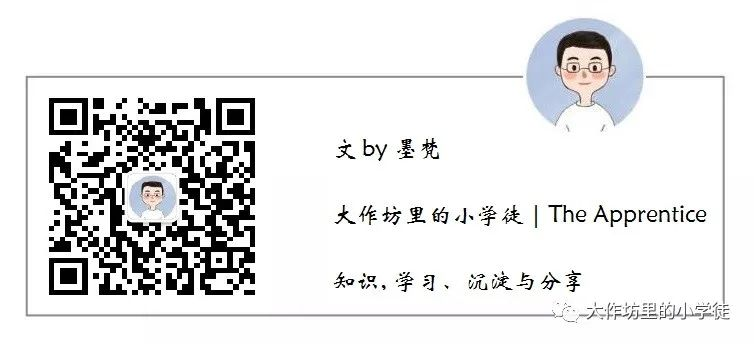

# cracking_the_cpp_interview

## 自我介绍
> 芝兰生于深谷，不以无人而不芳
> 君子修身养德，不以穷困而改志

笔名：`墨梵`，取自“点墨于心，梵音在耳”。
书虫一枚，喜欢读书、翻译和写作，曾经的伪文青。

我的梦想是什么？可以通过这一路走来的思考和过往不长不短的职业经历，影响和帮助更多的人。

我在寻找什么？精神与财务自由。

> 谈技术，聊人生，愿你在纷繁的世界中活得精彩～

## 译著
- [《C++23高级编程 (第6版)》](https://item.jd.com/10168368653888.html)
- [《C++ 20模板元编程》](https://item.jd.com/15103016.html)
- [《C++ Core Guidelines解析》](https://item.jd.com/14078078.html)
- [《C++ Templates (第2版·中文版)》](https://item.jd.com/14310382.html)
- [《C++20高级编程(第5版)》](https://item.jd.com/13706858.html)
- [《现代C++白皮书》](https://github.com/Cpp-Club/Cxx_HOPL4_zh)
- ...

## 本书初衷
本书旨在帮助C++程序员系统梳理面试过程中常见的技术问题，同时也关注成长路上的软技能、沟通表达与职业规划。面试不仅是技术的较量，更是心态、思维和人生选择的体现。
希望通过分享经验与思考，帮助读者在技术提升的同时，收获更广阔的视野与更坚定的自信，走好职业生涯的每一步。

## 致谢
感谢家人的理解与支持，特别是我的妻子和女儿，她们始终陪伴在我身边，给予我无尽的鼓励和温暖，是我坚持和前行的最大动力。没有她们的包容与陪伴，这本书无法顺利完成。

## 你也想加入到贡献者的行列
一个人的力量终究是有限的，这本书也是我在工作之余写出，难免有不够完善之处。另外，由于个人从事的是自动驾驶方向，对于博大精深的 C++，技能点也无法全部涉及并精深。如果有大佬想要分享自己的资源和见解，或者探讨某个技术点，可以直接在项目中发起 Pull Request，也欢迎和我邮件联系（josean_he@126.com）。

## 关于交流群的建立
由于时间因素，QQ/微信群和星球还在筹备中。

## 请作者喝杯下午茶
本书的内容是完全开源免费的，如果你觉得该项目对你真的有帮助，可以给仓库点个 star 或者请作者喝一杯下午茶。

