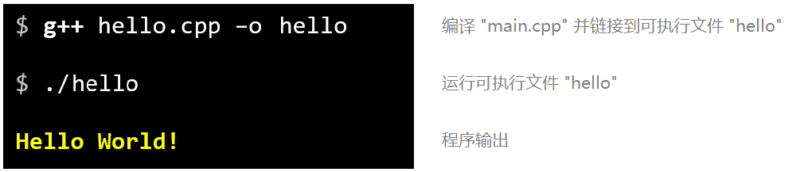
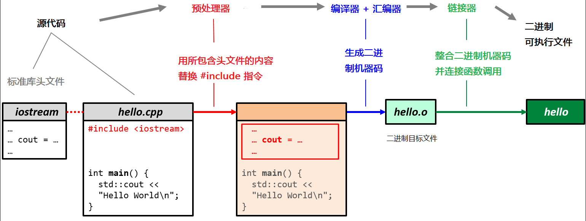
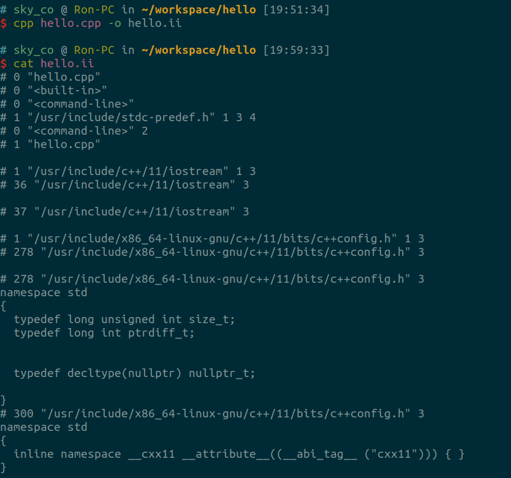
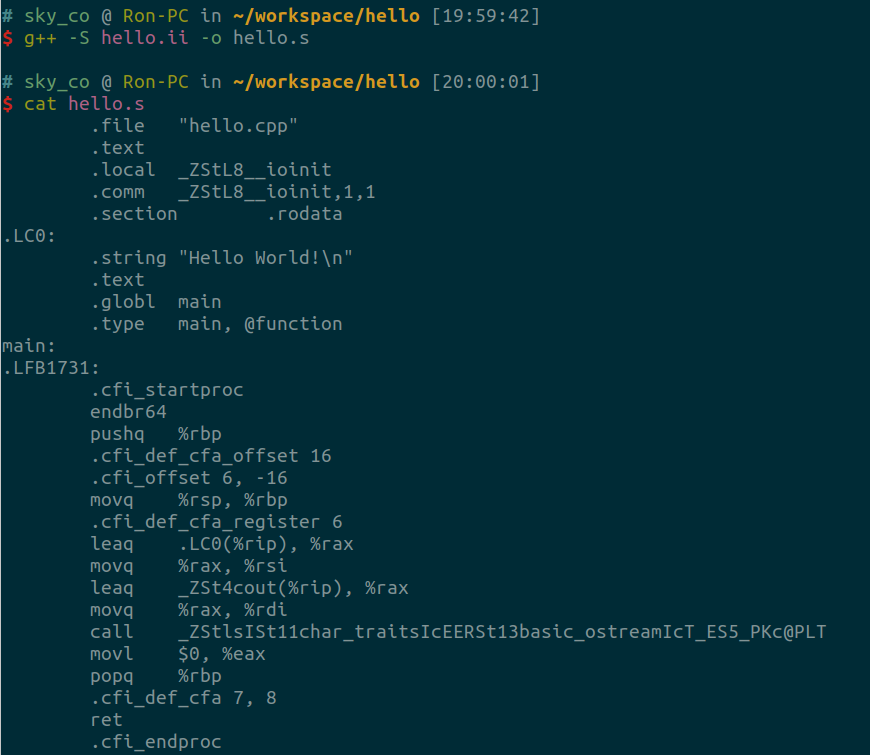
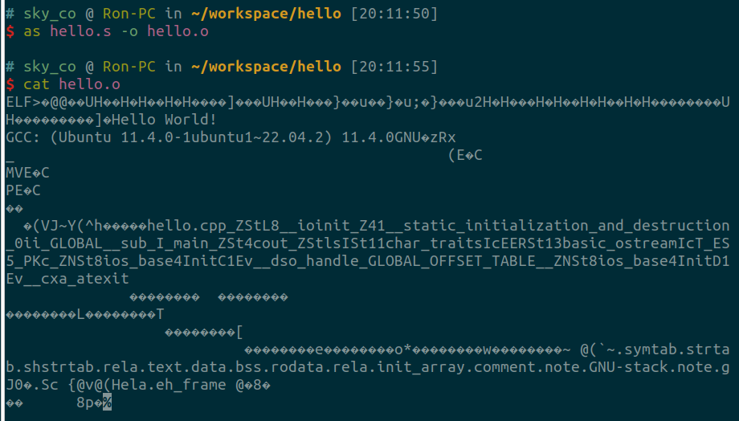
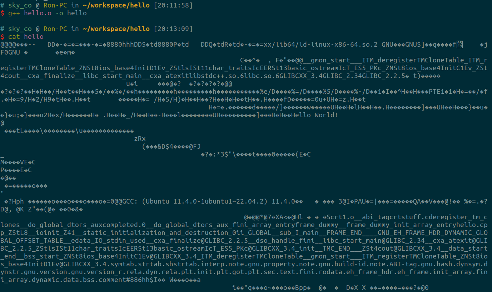

# 浅析 GCC 编译流程

上一篇我们提到 GCC 的工作原理、常用命令、优化选项及最佳实践。这一篇继续上一篇中涉及的编译流程的内容，并进行适当扩展。

## 编译+运行
代码不变，还是那个熟悉的 Hello World 程序：

```cpp
// hello.cpp
#include <iostream>

int main() {
    std::cout << "Hello World!\n";
}
```

编译源码并运行二进制可执行文件如下：


整个过程可简单理解为以下五步：


### 小提示 - 避免引入全局命名空间
许多代码示例/教程会展示类似这样的用法，即省去前缀 `std::`，代码如下：
```cpp
// hello.cpp
#include <iostream>

using namespace std;

int main () {
    cout << "Hello World!\n";
}
```

**注意：**
`using namespace xxx` 会将该命名空间xxx中的所有符号引入全局命名空间。这可能导致名称冲突和歧义，某些情况下甚至会引发仅在运行时显现且难以检测的错误。
在任何生产代码库中，用其他命名空间的所有符号污染全局命名空间都是严重的隐患，你应从一开始就避免这种反模式。

这里顺便补充一些基本知识点：
> C++是一种静态强类型编译型语言
- C++ 源代码无法直接运行
- C++ 代码是写给抽象机器模型的
- 编译器会将C++ 源代码转换为CPU可识别的二进制机器码
- 可执行程序即包含机器码的二进制可执行文件

### 小提示 - main 函数中返回的错误码
细心的读者可能会发现， `main` 函数中 少了一句 `return 0;`。少了这么一句真的可以吗？ 毕竟教科书里教的是，除了 `void` 函数以外，其他函数都必须有指定类型的返回值。
在 C++ 中，`main` 函数是程序的入口点，`return 0;` 的目的是向操作系统返回一个状态码，表示程序的执行结果。具体来说：
1. **返回值的意义**：
   - `return 0;` 表示程序成功执行，没有错误发生。
   - 如果返回一个非零值，通常表示程序遇到了某种错误或异常。

2. **现代 C++ 的变化**：
  在 C++11 标准及以后的版本中，如果 `main` 函数没有显式地返回值，编译器会自动在函数末尾添加 `return 0;`。这意味着即使你省略了 `return 0;`，程序仍然会正常结束，并返回 0 给操作系统。

因此，在现代 C++ 中，虽然可以省略 `return 0;`，但为了代码的清晰性和可读性，许多开发者仍然选择保留它。这样做可以明确地表明程序的结束状态，尤其是在较复杂的程序中。

### 术语
**编译器错误(compiler error):** 程序无法编译，编译器将停止
**编译器警告(compiler warning):** 程序可编译，编译器将继续运行，但存在可能导致运行时错误的问题代码
**静态(static):** 在编译时固定（嵌入可执行文件中，运行时不可更改）
**动态(dynamic):** 运行时可更改（可能由用户输入触发）

## GCC 源文件编译流程
GCC 编译一个源文件通常经历以下四个阶段：
> 预处理（Preprocessing） -> 编译（Compilation） -> 汇编（Assembly） -> 链接（Linking）


下面是针对给定 C++ 程序的编译过程的详细章节内容和相应的编译命令


### 1. 预处理
在这一阶段，预处理器（cpp）对源代码 `hello.cpp` 进行处理，主要任务包括处理预处理指令（如 `#include` 和 `#define`），并生成一个中间文件 `hello.ii`。这个文件包含了所有的宏替换和头文件的内容。

**编译命令：**
```bash
$ cpp hello.cpp -o hello.ii
```


### 2. 编译
编译器（ccl）将预处理后的文本文件 `hello.ii` 转换为汇编代码 `hello.s`。在这个阶段，编译器会进行语法分析、语义分析和优化等操作。

**编译命令：**
```bash
$ g++ -S hello.ii -o hello.s
```


### 3. 汇编
汇编器（as）将汇编代码 `hello.s` 转换为目标代码 `hello.o`。目标代码是机器语言的表示，但尚未链接成可执行文件。

**编译命令：**
```bash
$ as hello.s -o hello.o
```


### 4. 链接
链接器（ld）将目标代码 `hello.o` 和所需的库文件链接在一起，生成最终的可执行二进制文件 `hello`。在这个阶段，链接器会解决外部符号引用，并将所有代码和数据合并成一个可执行文件。

**编译命令：**
```bash
$ g++ hello.o -o hello
```

可以看到最终输出的二进制可执行文件`hello` 明显要比 `hello.o` 多一些内容，当然文件大小也相应增加。
关于二进制可执行文件的内容和检查工具，限于篇幅和文章主题限制，我们在下一篇中继续探讨，敬请期待 :)。

### 总结

通常，直接用 `gcc hello.cpp -o hello` 即可自动完成上述所有步骤。
最终，C++ 源代码 `hello.cpp` 被成功编译为用户看到的一个二进制可执行文件（本例为 `hello`）。
可以通过运行以下命令来执行程序：

```bash
$ ./hello
```

执行后，程序将输出：
```bash
$ Hello World!
```

**注意：**
> 如果没有指定输出文件（本例中为 `-o hello`），仅运行命令 `$ g++ hello.cpp` 则生成的二进制文件可执行文件默认为 `a.out`

## 拓展阅读
- [深入理解计算机系统](https://u.jd.com/0rCRUqb)
- [计算机程序的构造和解释](https://u.jd.com/01CRlrE)
- [计算机底层的秘密](https://u.jd.com/0DCViyi)
- [计算机系统要素](https://u.jd.com/0gCH76J)
- [链接器和加载器](https://u.jd.com/0gCVLHZ)
- [程序员的自我修养](https://u.jd.com/06CYBnt)
