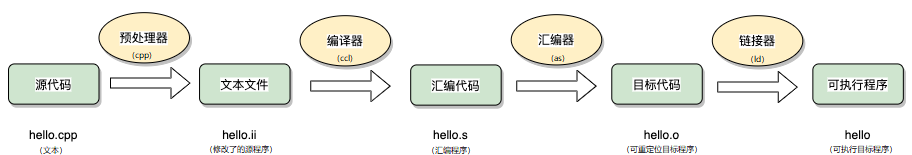
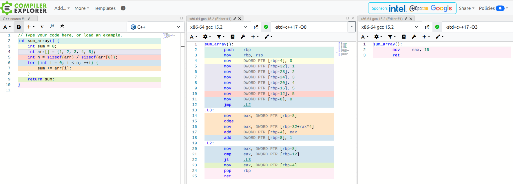

# 浅析 GCC 编译器优化

GCC（GNU Compiler Collection）是 Linux 下最常用的 C/C++ 编译器之一，支持多种语言和平台。本文结合相关资料，介绍 GCC 的工作原理、常用命令、优化选项及最佳实践。

## gcc 和 g++ 的区别和联系
- gcc 默认以 C 语言方式处理源文件，g++ 默认以 C++ 方式处理源文件。
- gcc 编译 C++ 文件时不会自动链接 C++ 标准库，g++ 会自动链接。
- gcc 只识别 C 语言的语法和头文件，g++ 识别 C++ 的语法和头文件。
- 如果用 gcc 编译 C++ 源文件，建议加上 `-lstdc++`，否则可能链接失败。
- g++ 支持 C++ 的运算符重载、模板等特性，gcc 不支持。
- 两者都可以用来编译汇编文件和链接目标文件。

由于 g++ 只是 gcc的一个子集，因此，gcc 和 g++的用法和参数基本相同。而本书主要立足与 C++ 相关内容，所以今天我们主要介绍 g++！

## GCC 编译流程
GCC 编译一个源文件通常经历以下四个阶段：
> 预处理（Preprocessing） -> 编译（Compilation） -> 汇编（Assembly） -> 链接（Linking）


（上述过程具体的分析和介绍，我们会在下一篇展开）

通常，直接用 `gcc hello.cpp -o hello` 即可自动完成上述所有步骤。
最终用户看到的就是一个二进制可执行文件(Windows下的可执行文件都以 .exe 作为文件扩展名)，本例为 `hello`.

**注意：**
> 如果没有指定输出文件（本例中为 `-o hello`），仅运行命令 `$ g++ hello.cpp` 则生成的二进制文件默认为 `a.out`

## 如何编译单个文件和多个文件
### 单个文件
```sh
g++ hello.cpp -o hello
```

### 多个文件（包含用户自定义头文件，假设头文件在当前目录）
通常只需在源文件中 `#include "myheader.h"`，编译时只需编译源文件即可。
```sh
g++ main.cpp myheader.h -o main
```

### 多个文件（包含用户自定义头文件，假设头文件在 include 目录）：
```sh
g++ -I./include main.cpp -o main
```
`-I` 选项指定头文件搜索路径，适用于项目结构复杂或头文件不在当前目录时。

### 编译指定目录下的所有源文件
`cpp`文件在目录`src`中，而头文件在`include`目录中
```sh
g++ src/*.cpp -I./include -o app
```

当然，现代的工具已经有很多强大的构建工具可以帮助你管理源文件（头文件和cpp文件）和编译选项及目录，比如 cmake、bazel、ninja 之类的构建工具和强大如 Visual Studio及Clion的一众IDE，但还是这些对于目前的你来说还暂时不需要，当务之急是专注于语言层面，`talk is cheap, show me your code !`

## 编译器优化选项
GCC 提供多种优化级别，常用如下：
- `-O0`：默认，不开启优化，便于调试。
- `-Og`：适合调试的优化，比 `O1` 更保守。
- `-O1`：基础优化，打开部分优化选项。
- `-O2`：常用发布优化，包含更多优化（如自动内联）。
- `-Os`：优化代码体积，适合嵌入式场景。
- `-O3`：激进优化，进一步提升性能，但可能影响调试和可移植性。
- `-Ofast`：开启所有高性能优化，可能不符合标准（如 IEEE 浮点）。


示例：
```sh
g++ -O2 hello.cpp -o hello
```

**现代编译器常见优化举例：**
- **自动内联（inline expansion）**：将小函数直接展开到调用处，减少函数调用开销。`-O2` 默认开启自动内联。
- **循环展开（loop unrolling）**：将循环体展开，减少循环次数，提高性能。`-funroll-loops`
- **死代码消除（dead code elimination）**：移除永远不会执行的代码。`-O2`、`-O3` 默认开启。
- **常量传播（constant propagation）**：将常量值直接替换到表达式中，减少计算。`-O2`、`-O3`
- **尾调用优化（tail call optimization）**：优化递归函数的尾调用，减少栈空间消耗。`-O2`、`-O3`
- **跨文件优化（Link Time Optimization, LTO）**：链接时全局优化，提升整体性能。`-flto`
- **指令乱序（instruction reordering）**：编译器会根据指令之间的依赖关系和处理器流水线特点，重新排列指令顺序，以减少等待和提升执行效率。`-O2`、`-O3` 默认会进行指令乱序优化。


以其中的循环展开为例，代码如下：

```cpp
int sum_array() {
    int sum = 0;
    int arr[] = {1, 2, 3, 4, 5};
    int n = sizeof(arr) / sizeof(arr[0]);
    for (int i = 0; i < n; ++i) {
        sum += arr[i];
    }
    return sum;
}
```

分别用不同优化级别编译：

```sh
g++ -O0 -S loop_unroll.cpp -o loop_O0.s
g++ -O3 -S loop_unroll.cpp -o loop_O3.s
```
（`-S` 用于告知编译器生成汇编文件 loop_xx.s）

对比汇编代码很容易发现：

- 在 `-O0` 下，循环体保持原样，逐步累加。
- 在 `-O3 -funroll-loops` 下，编译器会尝试将循环体展开，比如每次处理多个元素，减少循环判断和跳转次数，汇编代码会出现多次累加指令，循环次数减少。

你可以用 `less loop_O0.s` 和 `less loop_O3.s` 分别查看汇编文件，观察循环展开带来的指令变化和性能提升。
这里给大家推荐利器 [godbolt](https://godbolt.org/)。godbolt（Compiler Explorer）是一个强大的在线工具，可以让你实时查看 C/C++ 等多种语言的源代码在不同编译器和优化选项下生成的汇编代码。它支持多种编译器版本和参数设置，适合学习编译器优化原理、分析代码性能、对比不同编译器行为，是程序员和学习者探索底层实现和性能调优的利器。

**godbolt代码和编译请参见**： https://godbolt.org/z/eTYzb4Efj

可以明显看到在 `-O3` 优化开启的时候，10行的源码，编译器优化后的汇编代码仅剩 3 行，反观开启 `-O0` 时，生成的汇编代码还有 25 行。可见，优化级别越高，编译器能帮你做的事情也越多。

## 调试信息与优化
调试时建议关闭优化，并加上 `-g` 选项生成符号表：
```sh
g++ -g -O0 hello.cpp -o hello
```

这样可以在 GDB 中看到变量名和源码行号，便于调试。

## 编译选项最佳实践
- **开发调试**：`-g -O0` 或 `-g -Og`
- **发布版本**：`-O2` 或 `-O3`，根据性能需求选择
- **嵌入式/体积敏感**：`-Os`
- **特殊性能场景**：`-Ofast`（需评估标准兼容性）
- **多文件项目**：建议分步编译，利用并行编译加速
- **头文件管理**：只包含必要头文件，使用前向声明和预编译头（PCH）提升编译速度
- **警告选项**：推荐始终加上 `-Wall -Wextra`，开启所有常见和额外警告，有助于发现潜在 bug 和代码规范问题。
  ```sh
  g++ -Wall -Wextra main.cpp -o main
  ```
- **标准版本选项 `-std`**：用于指定 C/C++ 语言标准版本，保证代码兼容性和新特性支持。例如：
  - `-std=c++11`：启用 C++11 标准
  - `-std=c++17`：启用 C++17 标准
  - `-std=c++20`：启用 C++20 标准


## 参考资料
- [GCC 官方文档](https://gcc.gnu.org/onlinedocs/)
- [godbolt](https://godbolt.org)
- [cppreference](https://en.cppreference.com/w/)
