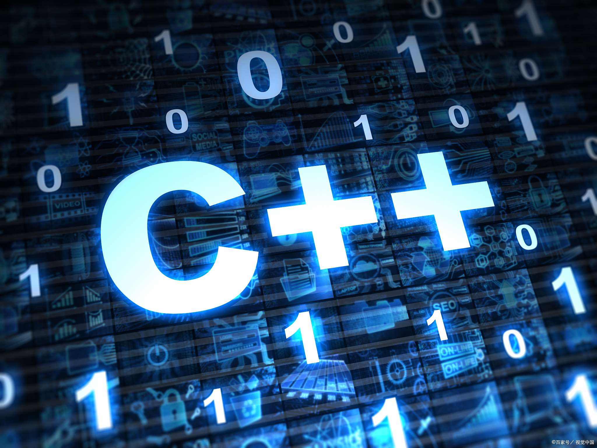
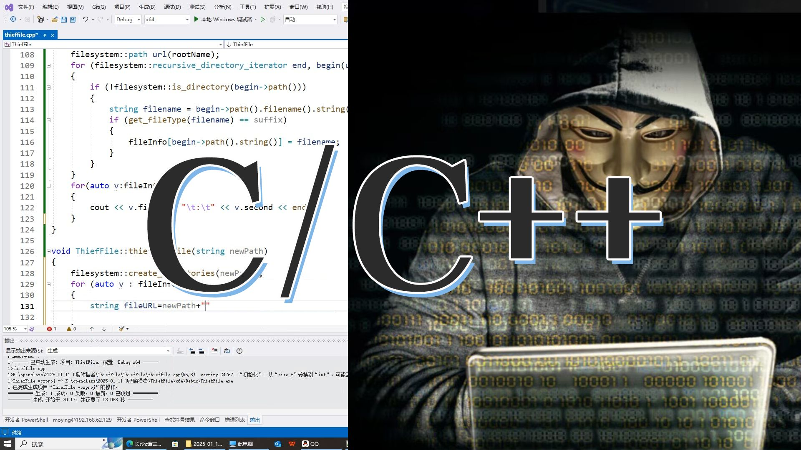

## C++ 中的常见的动态内存问题

在 C++ 编程中，（动态）内存管理是十分重要的。常见的（动态）内存问题包括：
- 内存泄漏（memory leak）
- 悬空指针 (dangling pointer)
- 双重释放或内存破坏(double free or corruption)
- 野指针（wild pointer）
- 内存越界（buffer overflow/underflow）
- 使用未初始化内存（uninitialized memory）

---

## 内存泄漏
**内存泄漏**是指程序在运行过程中新分配了一块内存（通常通过 `new` 关键字或 `malloc` 函数），但在不再需要使用时没有正确释放这块内存（通常通过 `delete` 或 `free`），从而导致程序所占用的内存逐渐增加。

### 造成内存泄漏的情况
- 忘记释放动态分配的内存。
- 多次分配内存而未释放前一次的分配。
- 异常发生后，控制流跳过了释放内存的代码。
- 循环引用导致智能指针无法释放（如 `std::shared_ptr` 互相引用）。
-

### 影响
- 随着程序运行时间的延长，内存泄漏会导致可用内存减少，最终可能导致程序崩溃或系统性能下降。

### 代码示例
```cpp
// leak.cpp
#include <iostream>

void leak() {
    int* a = new int[100]; // 分配内存
    // 忘记 delete[] a;
    // 若此函数频繁被调用，会逐步耗尽内存
}

int main() {
    for (int i = 0; i < 1000000; ++i) {
        leak();
    }
    std::cout << "done\n";
}
```

**注意：**
如果此处调用的是 `delete a;` 也会一样出现内存泄漏的问题。至于原因，大家可以自己动手查一查 :)。

### 修正示例
使用智能指针：智能指针可以自动管理内存，避免手动释放的错误。
```cpp
#include <iostream>
#include <memory>
#include <vector>

void smartPointerExample() {
    std::vector<int> a(100); // 自动管理内存
    // 或使用智能指针自动管理内存，出了作用域后，内存会自动释放
    // std::unique_ptr<int[]> a(new int[10]);
}

int main() {
    smartPointerExample();
}
```

### 最佳实践
- 使用智能指针或容器：`std::unique_ptr<T[]>`、`std::shared_ptr`、`std::vector`。
- 使用 `RAII`：将资源封装在对象的构造/析构中。
- 在可能抛出异常的路径使用 `try/catch` 或更好地使用智能指针避免显式 `delete`。
- 对长期运行的进程定期审计内存使用。
- 对于 `shared_ptr` 循环引用问题，可用 `std::weak_ptr` 解决。

### 工具介绍
- `Valgrind(memcheck)`：一个强大的内存分析工具，可以检测内存泄漏、使用未初始化内存、悬空指针等问题。
  ```sh
  valgrind --leak-check=full ./your_helloram
  ```
- `AddressSanitizer`：`GCC` 和 `Clang` 提供的内存错误检测工具。
  编译时加 `-fsanitize=address -g` 并运行，能报告泄漏与堆错误（GCC/Clang）。
- `heaptrack/massif(Google/Valgrind 工具)`：用于分析内存使用随时间的变化。

---

## 悬空指针
**悬空指针**是指指向已被释放内存的指针。这种指针仍然存在，但它指向的内存位置不再有效，俗称“野指针”。即指针的地址依然有效，但该地址所指向的内存区域的内容已经无效或被其他程序所占用。使用悬空指针可能会导致未定义行为，如程序崩溃或数据损坏。

### 造成悬空指针的情况
- 在释放内存后，指针仍然指向那个位置。
- 对象已经被销毁，但相关指针仍在使用。
- 返回局部变量地址或引用。

### 影响
- 程序可能出现崩溃、数据错误或安全漏洞，尤其是在访问已释放内存时。

### 代码示例
**示例 1：** 返回指向栈上局部对象的指针，函数返回后该内存不再属于该对象。
```cpp
// dangling.cpp
#include <iostream>

int* makeDangling() {
    int x = 42;
    return &x; // 返回局部变量地址 —— 悬空指针
}

int main() {
    int* p = makeDangling();
    std::cout << *p << std::endl; // 未定义行为
}
```

**示例2：** 释放后仍使用
```cpp
#include <iostream>

void danglingPointerExample() {
    int* ptr = new int(42);             // 动态分配内存
    delete ptr;                         // 释放内存
    // ptr 现在是悬空指针
    std::cout << *ptr << std::endl;     // 访问悬空指针，未定义行为
}

int main() {
    danglingPointerExample();
}
```

### 最佳实践
- 不返回指向局部对象的裸指针或引用；若需要返回所有权，返回智能指针（`std::unique_ptr`）。
- 释放后立即置为 `nullptr`。
- 尽量使用值语义或容器管理资源（避免裸指针，即使用 `new/delete`）。
- 在多线程中使用同步或明确所有权模型，避免并发释放与使用。

### 修正示例
**示例1** - 返回智能指针：超出作用域后自动释放内存
```cpp
#include <memory>
#include <vector>

std::unique_ptr<int> makeSafe() {
    return std::make_unique<int>(42);
}

std::vector<int> makeVector() {
    return std::vector<int>{1,2,3};     // 返回值优化，安全
}
```

**示例2** - 指针置空：在释放内存后立即将指针设置为 `nullptr`。
```cpp
#include <iostream>

void safePointerExample() {
    int* ptr = new int(42);     // 动态分配内存
    delete ptr;                 // 释放内存
    ptr = nullptr;              // 将指针置空
}

int main() {
    safePointerExample();
}
```

### 工具介绍
- `AddressSanitizer` (`-fsanitize=address`)：检测对已释放内存的访问。
- `Valgrind` (`memcheck`) 报告使用已释放内存（USE_AFTER_FREE）。
- `GDB`：断点与监视内存地址，跟踪指针何时被释放。

---

## 双重释放
双重释放是指在动态内存管理中，程序试图释放同一块内存两次（或多次）。这通常发生在调用 `free/delete` 时，而该内存块尚未被重新分配或仍然被视为有效内存。双重释放可能导致程序崩溃、数据损坏或安全漏洞。

### 造成双重释放的情况
- 未将指针置为空指针（nullptr）：在释放内存后，如果程序没有将指针设置为 `nullptr`，再次尝试释放该指针将导致双重释放。
- 错误的控制流：程序逻辑中的错误，例如在多次调用中条件判断不当，可能导致同一内存被释放多次。
- 多线程环境中的竞争条件：在多线程程序中，一个线程释放内存，而另一个线程可能在运行期间也尝试释放相同的内存。这样会导致意外的双重释放。
- 复杂的对象生命周期管理：在具有复杂数据结构的情况下，例如使用链表或树形结构，可能在不同地方释放同一块内存。

### 影响
- 程序崩溃：双重释放会导致运行时错误，通常表现为段错误（segmentation fault）或堆损坏，最终导致程序崩溃。
- 数据损坏：如果内存被重分配，尝试访问或写入已释放的内存可能导致数据损坏，出现未定义的行为或错误结果。
- 安全漏洞：攻击者可能利用双重释放漏洞来执行恶意代码，获取敏感信息，或绕过安全措施，从而提供潜在的安全风险。

### 代码示例
错误的所有权管理或逻辑错误、并发条件会导致同一内存被释放多次。

**示例1**：双重释放
```cpp
// double_free.cpp
#include <cstdlib>

int* p = (int*)malloc(sizeof(int));
free(p);    // 第一次 free 指针 p
free(p);    // 第二次 free 对同一指针 p -> 未定义行为，常导致崩溃或堆损坏
```

**示例2**：双重释放重复所有权导致 `double free`
```cpp
// double_free_shared.cpp
#include <memory>

struct Node {
    int v;
    ~Node() {}
};

int main() {
    Node* raw = new Node();
    std::unique_ptr<Node> a(raw);
    std::unique_ptr<Node> b(raw);   // 两个 unique_ptr 管理同一 raw 指针（错误用法）
    // 两个析构时都会 delete raw -> 双重释放
}
```

### 最佳实践
- 使用智能指针但要遵循所有权规则：`std::unique_ptr` 对唯一所有权，`std::shared_ptr` 用于共享所有权（且避免手动 `delete` 已由智能指针管理的原始指针）。
- 释放后置空指针（p = nullptr）。
- 避免把裸指针传给多个所有者，若确实需要共享，使用 `std::shared_ptr`。
- 在多线程中使用互斥或原子操作保证释放操作的互斥与一次性。
- 对复杂数据结构，厘清设计生命周期，并使用容器或所有权封装。

### 修正示例
```cpp
// double_free_fixed.cpp
#include <memory>

int main() {
    auto a = std::make_unique<int>(42);
    // 若需要共享，则使用 share_ptr
    auto s = std::make_shared<int>(42);     // 引用计数 +1
    auto s2 = s;                            // 引用计数正确处理释放
}
```

### 工具介绍
- `AddressSanitizer`：能检测 `double free`、`heap-buffer-overflow`、`heap-use-after-free` 等。
- `Valgrind` 和 `memcheck`：能报告 `invalid free`、`double free` 和堆损坏。
- `ASan` 和 `UBSan`（`UndefinedBehaviorSanitizer`）组合可在编译时开启更多运行时检查。
- E`lectric Fence`（老工具）：可用于快速暴露越界和 `double free` 问题。

---

## 野指针与内存越界
**野指针**是指未初始化或已释放但未置空的指针。野指针的使用会导致未定义行为，甚至安全漏洞。
**内存越界**（Buffer Overflow/Underflow）是指访问数组或缓冲区时超出其分配范围，可能导致数据损坏、程序崩溃或安全隐患。

### 预防措施
- 指针初始化为 `nullptr`。
- 释放后立即置空。
- 使用标准容器（如 `std::vector`）自动管理边界。
- 编译时开启边界检查工具（如 `AddressSanitizer`）。
- 避免裸指针操作，优先使用智能指针和容器。

### 代码示例
```cpp
#include <vector>

void bufferOverflow() {
    std::vector<int> v(5);
    v[10] = 42;     // 越界写入 -> 未定义行为
}

int main() {
    bufferOverflow();
}
```

---

## 使用未初始化内存
未初始化的变量或指针可能包含垃圾值，使用后果不可预测。

### 预防措施
- 始终初始化变量和指针。
- 使用标准容器和智能指针。
- 打开编译器开启警告（`-Wall` 和 `-Wextra`）。
- 使用工具检测（`Valgrind`、`AddressSanitizer`）。

---

## 通用预防措施
1. **智能指针**：使用 C++ 的智能指针（如 `std::unique_ptr` 和 `std::shared_ptr`）来自动管理内存。
2. **RAII（资源获取即初始化）**：通过构造函数和析构函数管理资源的生命周期，确保资源在离开作用域时自动释放。
3. **内存分析工具**：使用 `Valgrind`、`AddressSanitizer` 等工具定期检查内存泄漏和悬空指针问题。
4. **指针置空**：在释放内存后，将指针设置为 `nullptr`，减少误用风险。
5. **避免裸指针和手动 `new/delete`**：优先使用标准容器和智能指针。
6. **多线程安全**：在多线程环境下，使用互斥锁、原子操作等保证内存操作安全。

---

## 常用编译与工具命令汇总

### 使用 AddressSanitizer（推荐，快速）
`ASan` 能检测 `heap-buffer-overflow`、`use-after-free`、`double-free` 等；`LeakSanitizer`（通常随 ASan 一起）可用于检测内存泄漏。
```sh
g++ -O1 -g -fsanitize=address,undefined -fno-omit-frame-pointer hello.cpp -o hello
./hello
```

### 使用 Valgrind（详细、离线分析）
`Valgrind` 能报告内存泄漏、使用已释放内存、无效读取/写入等，适用于 Linux。
```sh
g++ -O2 -g hello.cpp -o hello
valgrind --leak-check=full --show-leak-kinds=all --track-origins=yes ./hello
```

### 使用 UBSan（undefined behavior sanitizer）
`UBSan` 检测整数溢出、未定义行为等，配合 ASan 更全面。
```sh
g++ -O1 -g -fsanitize=undefined -fno-omit-frame-pointer hello.cpp -o hello_ubsan
./hello_ubsan
```

### 使用 GDB 调试
在调试器中设置断点、打印指针与内存内容，检查生命周期。
```sh
g++ -O0 -g hello.cpp -o hello_dbg
gdb ./hello_dbg
```

## 补充

### 当基类的析构函数未声明为 virtual
当基类的析构函数未声明为 `virtual`，但通过基类指针（指向子类对象）调用 `delete` 时，行为是未定义的。常见后果包括对象的派生类部分不会被正确析构，导致资源泄漏或更严重的错误（如双重释放、内存破坏、崩溃）。下面用简短示例说明原因、典型结果和修复方法。

示例：
```cpp
#include <iostream>

struct Base {
    // 非 virtual 析构函数
    ~Base() { std::cout << "Base::~Base\n"; }
};

struct Derived : Base {
    int* p;
    Derived() : p(new int[10]) {}
    ~Derived() {
        delete[] p;
        std::cout << "Derived::~Derived\n";
    }
};

int main() {
    Base* b = new Derived();
    delete b; // 未定义行为：`Derived::~Derived` 可能不会被调用
}
```

**可能结果**
- 程序只会调用 `Base::~Base`，而 `Derived::~Derived` 未被调用，导致子类资源（如 `p`）内存泄漏；
- 更严重时会造成程序崩溃或堆损坏（如果 `Derived` 的析构有释放共享资源或进行重要清理）；
- 由于是未定义行为，实际表现依赖编译器、运行时、优化级别和平台。

**原因说明**
- `delete b;` 会根据 `b` 的静态类型（Base*）调用相应的析构函数；若析构非 `virtual`，编译器不会通过运行时类型信息（vtable）派发到 `Derived` 的析构函数，因此 `Derived` 的析构函数不会执行。
- 将基类的析构函数设为 `virtual` 会在基类中建立多态析构机制，`delete` 时会按对象的动态类型正确调用完整析构链（先调用 `Derived::~Derived` 再调用 `Base::~Base`）。

**修复方法（推荐）**
- 将基类析构函数声明为 `virtual`（若类有任何虚函数或预计通过基类指针删除派生对象）：
```cpp
struct Base {
    virtual ~Base() = default;
};
```
- 若基类不应被继承或对象不应通过基类指针删除，可以：
  - 禁止继承或删除操作：使析构为 `protected` 或为非多态类型，并在设计文档中说明所有权规则；
  - 使用智能指针并明确所有权（`std::unique_ptr<Base>` 在析构时也需要 `virtual ~Base` 来正确删除派生对象，除非自定义删除器）。

额外提示：
- 若类中已有其他虚函数，通常也应将析构函数声明为 `virtual`；
- 使用 `clang-tidy`、`cppcheck` 等静态分析器可检测基类含虚函数但析构非 virtual或通过基类指针删除派生对象的潜在问题。

### C++ 的边界检查
C++ 没有把运行时的内存边界检查作为语言强制特性，主要是出于设计哲学（控制权与最小抽象开销）、性能成本（时间/空间开销）和与现有生态兼容性的权衡。C++ 通过“按需启用”检查（库函数、编译器开关、动态分析工具、静态分析）和鼓励更安全的范式（智能指针、容器、`RAII`）来在性能与安全之间做工程化折衷。
我们可以用编译器选项、工具与库在开发/调试阶段补充检查，但把检查纳入语言标准会带来难以接受的后果。若需要语言级别的安全保证，应考虑使用为此目的设计的语言（如 Rust）或在受控环境下启用现有诊断工具。

#### 语言设计角度
- **零开销的抽象原则**：C++ 的核心承诺之一是“零开销的抽象”（zero-overhead principle）：如果程序不使用某特性，就不应为该特性付运行时开销。而强制边界检查意味着所有数组/指针操作都带检查开销，这会违背这一承诺。
- **低级控制与表达能力**：C++ 旨在服务系统级编程，需要直接控制内存布局、对齐、未初始化内存、指针算术等。许多正确的低级用法（例如在缓冲区内做偏移、与硬件内存映射交互、内存池、置换内存）会被简单的边界检查误报或限制。
- **后向兼容性与 `ABI` 稳定性**：把检查内建到基本操作（例如 `operator[]`、裸指针解引用）会改变现有库/二进制的行为与性能，造成大量现存代码不兼容或性能退化。
- **表达不同语义的数组访问**：C++ 中存在多种访问方式（裸指针、`std::array`、`std::vector`、`memcpy`、`placement new`、`reinterpret_cast` 等）。难以定义一个统一的、既能覆盖全部场景又不误报的“边界”概念。
- **语言复杂性与规范实现成本**：标准若要求内建检查，需要定义具体运行时行为（错误抛出、异常、terminate、回退策略），并规定实现细节（何时检查、如何报告），这会显著增加语言和标准库的复杂性。

#### 性能角度
- **时间成本（运行时开销）**
  - 每次数组/指针访问添加检查会引入分支、比较或函数调用。内层循环和热路径中微小的检查开销会被放大，影响吞吐和延迟。
  - 即使编译器可以消除部分检查（范围分析、循环不变性消除等），许多动态情况（指针来自外部、不可静态推断）仍需检查。
- **空间成本（代码尺寸与内存）**
  - 检查代码、错误处理路径和诊断信息会增加可执行文件大小，影响缓存利用（指令缓存、ICache），从而间接降低性能。
  - 运行时需额外存储边界元数据（例如为每个分配保存大小），这对大量小分配或嵌入式系统是显著开销。
- **可优化性下降**
  - 编译器对没有检查的原始内存访问能做的积极优化（矢量化、内联、重排、预取）可能因插入检查而受限。即使静态分析能去掉检查，编译复杂度和分析时间也会上升。
- **延迟与实时系统影响**
  - 在实时/嵌入式领域，确定性延迟非常重要。不可预测的检查开销（特别是分支预测失败或异常处理）会破坏实时性保证。
- **并发与原子性影响**
  - 在多线程场景中维护和检查边界元数据要求同步或原子操作，进一步增加延迟和复杂性，甚至诱发新的竞态条件。

#### 可行替代与折衷方案
- **可选的编译时/运行时检测**
  - STL 的 `at()`：`std::vector::at` 在越界时抛出异常，但 `operator[]` 不检查，提供了选择权。
  - 编译器/库开关：`-D_GLIBCXX_DEBUG`、`MSVC` 的安全检查能在调试构建中启用更严格检查。
- **静态分析与形式验证**
  - `Clang Static Analyzer`、`Cppcheck`、`Frama-C`、`Infer` 等工具在编译阶段发现潜在越界，零运行时成本。
- **动态检测工具**
  - `AddressSanitizer`、`Valgrind`、`MemorySanitizer` 在测试/调试时广泛使用，开销可接受（用于开发而非生产）。

---

## 总结
C++ 的动态内存管理虽然灵活强大，但也带来了诸多风险，如内存泄漏、悬空指针、野指针、内存越界和双重释放等问题。现代 C++ 推荐优先使用智能指针（如 `std::unique_ptr`、`std::shared_ptr`）、标准容器和 `RAII` 技术来自动管理资源，减少手动 `new/delete` 的错误。配合 `AddressSanitizer`、`Valgrind` 等工具进行定期检测和调试，可以大幅提升程序的健壮性和安全性。良好的内存管理习惯和工具支持，是高质量 C++ 程序开发的基础。
通过学习和实践这些资料，希望你可以进一步提升对 C++ 内存管理和安全编程的理解与掌握。

---


## 拓展阅读
- [《Effective C++》](https://book.douban.com/subject/5387403)
- [《More Effective C++》](https://book.douban.com/subject/5908727)
- [《Effective Modern C++》](https://book.douban.com/subject/30178902)
- [《C++ Core Guidelines解析》](https://book.douban.com/subject/36513376/)
- [《Beautiful C++》](https://book.douban.com/subject/35660058)
- [Valgrind 官方文档](https://valgrind.org/docs/manual.html)
- [AddressSanitizer 官方文档](https://clang.llvm.org/docs/AddressSanitizer.html)
- [C++ Core Guidelines](https://github.com/isocpp/CppCoreGuidelines)
- [cppreference.com C++ 内存管理条目](https://en.cppreference.com/w/cpp/memory)
- [Google C++ Style Guide](https://google.github.io/styleguide/cppguide.html)
