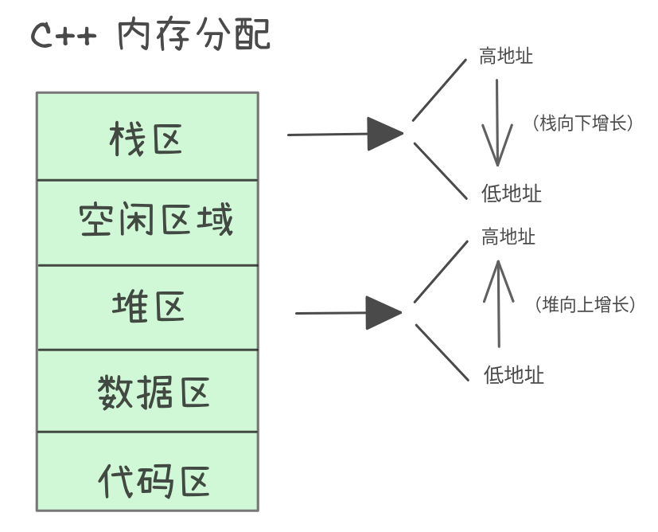

# C++内存管理的探讨


一般来说，在C++中，代码、数据等都存放在不同的内存区域，这些内存区域从逻辑上做了划分且每个区域都有其特定的用途，大致分为以下几个区域：代码区、全局/静态存储区、栈区、堆区和常量区。


## 栈区（Stack）
### 存储内容
- 局部变量、函数参数、返回地址、临时值（寄存器溢出保存）等。对于多线程程序来说，栈区里的内容是线程的私有资源（相对于另一个进程中的线程来说），你几乎没有办法访问另一个进程地址空间中的数据。

### 初始化与销毁时机
- 初始化：当函数被调用并为其栈帧分配空间时，局部变量按其定义方式（无初始值、默认初始化或显式初始化）被初始化。具有非平凡构造函数的局部对象在到达其定义处时构造。
- 销毁：函数返回或控制流离开变量的作用域时，局部对象按逆序（LIFO）析构并释放其栈空间（自动）。

### 注意事项
- 不要返回指向栈上局部变量的指针或引用（悬挂引用）。
- 栈空间有限（线程栈大小受限），避免在栈上分配大型数据结构。
- 大数组或深递归可能导致栈溢出。

### 补充
栈大小没有统一的标准，取决于操作系统、编译器、运行时环境、进程类型与平台。常见默认值（典型）：
- Linux (x86_64, glibc)：
  - 主线程（进程）默认通常为 8 MB。
  - 新创建的线程（pthread）默认栈通常为 2 MB（可由 pthread_attr_setstacksize 调整）。
- Windows (x86_64)：
  - 默认约为 1 MB（32-bit 程序常见），64-bit 可执行文件常见为 1 MB 或更高；可在链接时通过 /STACK 选项或在 PE 头中设置。
- macOS：
  - 主线程通常为 8 MB；pthread 默认栈也通常为 8 MB（版本与配置有差异）。
- 嵌入式/裸机：
  - 由链接脚本或启动代码决定，可能只有几十 KB 到几百 KB，甚至更小。
- 容器环境（Docker）：
  - 容器内默认继承宿主系统的线程栈限制（例如 Linux 的默认 8 MB），但受 ulimit、cgroups 限制时可能不同。
- 其它（JVM/语言运行时）：
  - 运行时可能会调整或虚拟化线程栈（例如 Java 的 -Xss 设置，常见默认 1 MB~1 MB+）。

如何查询与修改：
- Linux：查看主线程限制：ulimit -s （单位 KB）；pthread 可用 pthread_attr_getstacksize / pthread_attr_setstacksize 设置；可在编译/链接时或通过线程库接口调整。
- Windows：链接器选项 /STACK 或在 Visual Studio 的项目属性中设置；也可使用 CreateThread 的参数指定栈大小。
- macOS：pthread_attr_setstacksize / launchctl limit 等。

### 最佳实践
- 对需跨作用域保存的数据使用堆或静态存储，而非栈。
- 使用自动对象（RAII）管理资源，依赖析构函数释放资源。
- 对可能因递归深度或大缓冲区导致栈溢出的场景改用动态分配或迭代算法。

## 堆区（Heap / Free Store）
### 存储内容
- 动态分配对象、动态数组、运行时大小未知的数据结构。对于多线程程序来说，任何一个线程都可以访问指针指向的数据，因此堆区是线程间共享的资源。

### 初始化与销毁时机
- 初始化：通过 new / new[]（或 malloc 后 placement new）分配并构造对象；也可使用智能指针或容器封装分配。
- 销毁：必须显式调用 delete / delete[] 或 free（对应 malloc）；若使用智能指针（std::unique_ptr/std::shared_ptr）或容器，资源在最后一个所有者销毁时自动释放。

### 注意事项
- 避免内存泄漏（忘记释放）；避免双重释放（重复 delete）。
- 注意异常安全：在分配后若抛异常需确保已分配资源被释放（使用 RAII）。
- 避免悬挂指针：释放后不要继续使用旧指针。
- new/delete 要配对（new[] 与 delete[]）准确使用。

### 最佳实践
- 优先使用标准容器（std::vector/std::string/...）和智能指针（std::unique_ptr/std::shared_ptr）而不是裸 new/delete。
- 尽量限制动态分配的范围与生命周期，使用 RAII 封装分配。
- 对性能敏感处使用对象池/内存池并仔细衡量复杂性。
- 在多线程环境确保堆分配的并发安全或使用线程局部缓存（tcmalloc/ jemalloc 等）。

## 数据段（Data Segment）
### 存储内容
- 已初始化的全局/静态变量（.data）、未初始化的（BSS）、常量（只读段，如 .rodata）。

### 初始化与销毁时机
- 初始化：
  - 静态初始化（零初始化或常量初始化）在程序加载或启动前完成（编译器/运行时保证）。
  - 动态初始化（需要运行时代码，如非 constexpr 的构造）在进入 main 之前完成，跨编译单元的初始化顺序未定义（静态初始化顺序问题）。
- 销毁：程序退出时按逆序（编译器/运行时规则）调用全局/静态对象的析构函数（通常在 exit/程序终止阶段）。

### 注意事项
- 避免依赖不同翻译单元间静态初始化顺序（可能导致未初始化使用）。
- 全局可变状态增加耦合，难以测试与并发安全问题。
- 在库中定义非局部静态对象需注意生命周期与可见性。

### 最佳实践
- 最小化可变全局状态；若需要，使用函数内局部静态+函数接口实现按需初始化（Meyers 单例风格）：
  - static T& instance() { static T t; return t; }
- 将只读常量放入 constexpr 或匿名命名空间以限制可见性。
- 使用依赖注入或将状态封装在对象中以便测试和并发控制。

---

## 代码段（Code Segment）
### 存储内容
- 程序机器指令（全局函数、静态函数、类成员函数的实现、内联函数在某些情况下会被复制）、只读常量字面值（.rodata）。

### 初始化与销毁时机
- 初始化：代码段在程序加载时（或动态库加载时）由操作系统/加载器映射到内存；无需“构造”。
- 销毁：程序结束或动态库卸载时由系统回收；代码本身不“析构”。

### 注意事项（针对各种函数类别）
- 普通/全局函数：不可写（只读）；注意函数指针使用与跨模块可见性。
- 静态（文件作用域）函数：仅在其翻译单元可见，避免命名冲突；链接可见性受影响。
- 类内定义的函数（成员函数）：
  - 非虚成员函数：同样存放于代码段；每个对象不包含函数代码，只包含 this 指针与数据成员。
  - 虚函数：虚函数实现存放在代码段，但对象包含指向虚表的指针（vptr），虚表通常在只读数据段或实现定义处生成并在加载时初始化。
- 内联函数：编译器可选择内联（将代码插入调用处）或保留一个外部可调用定义；内联与模板实例化会影响代码大小与链接。

### 最佳实践
- 限制函数可见性（static、anonymous namespace、visibility attributes）以减少符号冲突与外部接口攻击面。
- 对频繁调用的短函数考虑 inline 提示，但依赖编译器优化决定实际内联。
- 对类的成员函数，非模板/非内联实现放在 .cpp 中以缩短编译时间和隐藏实现细节。
- 对虚函数和多态使用要有性能意识（虚调用成本）；必要时使用 final、sealed、模板或静态多态（CRTP）代替。

---

## 代码示例


下面的代码给出上述分析的一个简单实现和验证：
```cpp
#include <iostream>
#include <memory>
#include <vector>

struct A {
    A(const char* n): name(n) { std::cout << "Construct " << name << "\n"; }
    ~A() { std::cout << "Destruct " << name << "\n"; }
    const char* name;
};

// 全局（数据段）对象（初始化在 main 之前，销毁在程序退出时）
A globalA("globalA");

// 静态全局变量（file-scope static，作用域限于本翻译单元，存储在数据段）
static A staticGlobalA("staticGlobalA");

// 函数内按需静态（数据段/初始化顺序安全示例）
A& getSingleton() {
    static A s("local static s"); // 第一次调用时构造，程序退出时销毁
    return s;
}

void stackExample() {
    A a("stack a");               // 进入作用域时构造，离开作用域时析构
    {
        A b("stack b");           // 嵌套作用域，离开时先析构 b 再 a
    }
}

void heapExample() {
    A* p = new A("heap p");       // new 时构造（堆）
    delete p;                     // delete 时析构并释放
    // 推荐：用智能指针管理
    auto up = std::make_unique<A>("unique_ptr up"); // 离开作用域时自动析构并释放
}

class C {
public:
    void member() {                // 类成员函数的代码在代码段；调用才创建栈帧与局部变量
        A m("member-local m");
    }
    static void staticMember() {   // 静态成员函数也在代码段，可在没有实例下调用
        A s("static member s");
    }
    virtual void vfunc() {         // 虚函数：实现仍在代码段，对象含 vptr 指向虚表
        A v("virtual v");
    }
};

int main() {
    std::cout << "main start\n";
    stackExample();        // 构造 & 析构栈对象
    heapExample();         // heap 分配与智能指针示例
    getSingleton();        // 第一次调用构造 local static
    C c;
    c.member();            // 成员函数内部栈对象构造/析构
    C::staticMember();     // 静态成员函数内部栈对象构造/析构
    c.vfunc();             // 虚函数调用，局部对象构造/析构
    std::cout << "main end\n";
    return 0;
}
```

初始化与销毁顺序分析（典型行为）
- 程序加载/启动阶段（在进入 main 之前）：
  1. 静态存储期对象执行静态初始化（零初始化/常量初始化）；
  2. 接着执行动态初始化（非 constexpr 构造）的静态存储期对象。对于本翻译单元，通常顺序是源代码中出现的顺序，因此先构造 globalA，再构造 staticGlobalA。但跨翻译单元的顺序未定义。
  - 因此启动阶段会输出：
    - Construct globalA
    - Construct staticGlobalA
- 运行时（main 执行过程中）：
  - main start
  - stackExample():
    - Construct stack a
    - Construct stack b
    - Destruct stack b
    - Destruct stack a
  - heapExample():
    - Construct heap p
    - Destruct heap p
    - Construct unique_ptr up
    - Destruct unique_ptr up (当 up 离开 heapExample 的作用域)
  - getSingleton(): 第一次调用时构造函数内静态对象 local static s：
    - Construct local static s
  - C c; c.member():
    - Construct member-local m
    - Destruct member-local m
  - C::staticMember():
    - Construct static member s
    - Destruct static member s
  - c.vfunc():
    - Construct virtual v
    - Destruct virtual v
  - main end
- 程序退出阶段（返回到运行时/CRT 清理）：
  - 以与初始化相反的顺序（逆序）对静态存储期对象调用析构函数。对于同一翻译单元内，通常逆序为：先析构 local static s（因为是静态局部且构造晚于全局）、然后析构 staticGlobalA，再析构 globalA. 最终输出：
    - Destruct local static s
    - Destruct staticGlobalA
    - Destruct globalA

**注意事项**
- static（staticGlobalA）和非 static 的全局对象（globalA）都具有静态存储期，均在程序启动前/进入 main 前完成初始化，但其可见性不同：staticGlobalA 仅限当前翻译单元。
- 函数内静态（local static）s 在首次执行 getSingleton() 时才初始化，且保证线程安全（自 C++11 起）；其析构发生在程序终止阶段，与其他静态对象的析构顺序遵循实现定义（通常是逆序）。
- 跨翻译单元的静态初始化顺序未定义，可能导致“静态初始化顺序问题”；避免该问题的常用手段是使用函数内静态（Meyers 单例）或显式初始化控制。

总之，典型输出顺序如下（按上述代码、单一翻译单元假设）：
```cpp
Construct globalA
Construct staticGlobalA
main start
Construct stack a
Construct stack b
Destruct stack b
Destruct stack a
Construct heap p
Destruct heap p
Construct unique_ptr up
Destruct unique_ptr up
Construct local static s
Construct member-local m
Destruct member-local m
Construct static member s
Destruct static member s
Construct virtual v
Destruct virtual v
main end
Destruct local static s
Destruct staticGlobalA
Destruct globalA
```

**注意**
不同平台和编译器的具体初始化顺序、链接器行为可能略有差异，尤其是跨翻译单元的静态初始化顺序；析构顺序通常为初始化的逆序，但跨单元顺序不保证

## 总结
- 栈：自动初始化/销毁、速度快、适合短期小对象；注意栈溢出与悬挂引用；最佳用 RAII、避免大对象。
- 堆：手动或 RAII 初始化/销毁、灵活但有泄漏风险；最佳用容器/智能指针与池化策略。
- 数据段（全局/静态）：程序启动前初始化、程序结束时销毁；注意初始化顺序与全局状态；最佳最小化全局可变状态，用按需本地静态封装。
- 代码段：函数实现与只读常量；无构造/析构，仅需关注可见性、内联与虚表机制。


## 拓展阅读
- ISO C++ 标准（有关对象生命周期、初始化顺序、存储期的规范章节）
- [数据段、代码段、堆栈段、BSS段的区别](https://ivanzz1001.github.io/records/post/cplusplus/2018/11/12/cpluscplus-segment)
- [What is stack and heap](https://martinlwx.github.io/en/what-is-the-heap-and-stack/)
- [c++基础概念深度理解](https://blog.csdn.net/XWWW668899/article/details/141901761)
