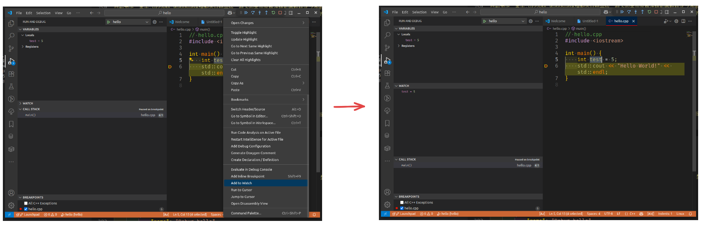

# VS Code C++ 开发与调试环境配置指南

Visual Studio Code（VS Code）是一款轻量级、跨平台的代码编辑器，凭借丰富的插件生态和强大的调试功能，成为众多 C++ 开发者的首选。本文将结合主流资源，介绍如何在 Linux（或 WSL）环境下，基于 VS Code 搭建高效的 C++ 开发与调试环境，并推荐常用插件和实用配置。

## 基础环境准备
1. **安装 VS Code**
   [官方下载](https://code.visualstudio.com/) 或使用包管理器安装。

2. **安装 C++ 编译器**
   推荐 GCC 或 Clang。编译器安装，[C++ 编程环境入门](tech_interview/C&C++/hello_world.md)已经介绍过，在此不做过多赘述。本文仅以 Ubuntu 下 GCC 为例：
   ```sh
   sudo apt update
   sudo apt install build-essential
   ```

3. **安装 VS Code 必备插件**

以下是一些常见的插件推荐
   - **C/C++（ms-vscode.cpptools）**：微软官方，代码补全、语法高亮、调试支持。
   - **Better Comments (aaron-bond.better-comments)**:注释显示不同的颜色。
   - **Clang-Format (xaver.clang-format)**：代码格式化，支持 `.clang-format` 配置。
   - **indent-rainbow (oderwat.indent-rainbow)**:通过颜色，一眼区分缩进。
   - **CMake Tools (ms-vscode.cmake-tools)**：CMake 项目管理与构建。
   - **CodeLLDB (vadimcn.vscode-lldb)**：LLDB 调试器支持，适合 macOS 或 Clang 用户。
   - **Better C++ Syntax (jeff-hykin.better-cpp-syntax)**：增强语法高亮。
   - **Bracket Pair Color DLW (BracketPairColorDLW.bracket-pair-color-dlw)**：括号配对高亮。
   - **GitLens (eamodio.gitlens)**：Git 集成与代码历史查看。
   - **TODO Highlight (wayou.vscode-todo-highlight)**：高亮 TODO、FIXME 等注释。
   - **Bookmarks (alefragnani.Bookmarks)**：代码书签，快速定位。
   - **Remote - SSH (ms-vscode-remote.remote-ssh)**：远程开发支持。
   - **Copilot(GitHub.copilot)**: 开源免费的 AI 助手


你可以选择手动选择某个插件安装，也可以在命令行一键安装，比如 `C/C++`插件：
```sh
   code --install-extension ms-vscode.cpptools
   ```

## 核心配置文件说明

### 用户设置（settings.json）
settings.json 位于`~/.config/Code/User/settings.json`。它是 VS Code 的用户或工作区配置文件，用于设置编辑器行为、插件参数和开发环境选项。例如，可以配置缩进宽度、自动格式化、C++ 编译器路径、智能感知模式、代码高亮、格式化风格等。通过自定义 settings.json，可以让 VS Code 更好地适应个人或团队的开发习惯，提升开发效率和代码规范性。
路径：

**常用配置示例：**
```json
{
    // workbench
    "workbench.editor.enablePreview": false,
    "workbench.editor.enablePreviewFromQuickOpen": false,
    "workbench.sideBar.location": "left",
    "workbench.tree.indent": 15,
    // system
    "json.maxItemsComputed": 80000,
    "terminal.integrated.fontSize": 16,
    // editor
    // editor
    "editor.formatOnSave": true,
    "editor.fontSize": 19,
    "editor.renderWhitespace": "all",
    "editor.renderControlCharacters": true,
    "editor.detectIndentation": false,
    "editor.rename.enablePreview": false,
    "editor.smoothScrolling": false,
    "editor.cursorSmoothCaretAnimation": "off",
    "editor.minimap.maxColumn": 30,
    "editor.minimap.renderCharacters": false,
    "editor.suggest.insertMode": "replace",
    "editor.wordWrap": "on",
    "editor.autoIndent": "brackets",
    "[cpp]": {
        "editor.defaultFormatter": "xaver.clang-format"
    },
    "editor.quickSuggestions": {
        "other": false,
        "comments": false,
        "strings": false
    },
    "editor.parameterHints.enabled": false,
    "editor.rulers": [
        120,
        200
    ],
    "editor.lineHeight": 24,
    "editor.wordSeparators": "`~!@#$%^&*()-=+[{]}\\|;:'\",.<>/?·～！￥…（）—【】、；：‘’“”，。《》？ ",
    // explorer
    "explorer.confirmDragAndDrop": false,
    "explorer.confirmDelete": false,
    "editor.largeFileOptimizations": false,
    // files
    "files.autoSave": "afterDelay",
    "files.trimFinalNewlines": true,
    "files.trimTrailingWhitespace": true,
    "files.insertFinalNewline": true,
    "files.autoGuessEncoding": true,
    // git
    "git.detectSubmodulesLimit": 300,
    "git.autofetch": false,
    "gitlens.codeLens.scopes": [
        "document"
    ],
    "gitlens.advanced.messages": {
        "suppressCommitHasNoPreviousCommitWarning": false,
        "suppressCommitNotFoundWarning": false,
        "suppressFileNotUnderSourceControlWarning": true,
        "suppressGitDisabledWarning": false,
        "suppressGitVersionWarning": false,
        "suppressLineUncommittedWarning": false,
        "suppressNoRepositoryWarning": false,
    },
    "gitlens.integrations.enabled": true,
    //extensions
    "extensions.ignoreRecommendations": true,
    // clang-format
    "clang-format.executable": "/usr/bin/clang-format-14",
    // todo-tree
    "todo-tree.general.tags": [
        "BUG",
        "HACK",
        "FIXME",
        "TODO",
        "XXX",
        "[ ]",
        "[x]"
    ],
    "todo-tree.regex.regex": "(//|#|<!--|;|/\\*|^|^\\s*(-|\\d+.))\\s*($TAGS)",
    "security.workspace.trust.untrustedFiles": "newWindow",
    "security.workspace.trust.banner": "never",
    "cmake.pinnedCommands": [
        "workbench.action.tasks.configureTaskRunner",
        "workbench.action.tasks.runTask"
    ],
    "explorer.confirmPasteNative": false,
}
```
说明：
- 自动格式化、智能感知、指定编译器路径等。
- `clang-format.style` 设置为 `file`，表示使用项目根目录或指定路径下的 `.clang-format` 文件。
- 启用 Error Lens、Bracket Pair Colorizer 等插件功能。

### 代码片段（cpp.json）
cpp.json 位于`~/.config/Code/User/snippets/cpp.json`， 它是 VS Code 的 C++ 代码片段（snippets）配置文件。它用于自定义常用代码模板，提升编写效率。例如，输入特定前缀（如 main、cerr、///），即可快速插入主函数、调试输出、Doxygen 注释等代码块。这样可以减少重复输入，提高开发速度和规范性。每个片段可自定义前缀、内容和描述，适合个人或团队常用代码风格。

示例片段：
```json
{
    "main": {
        "prefix": "main",
        "body": [
            "#include <iostream>",
            "",
            "int main() {",
            "    std::cout << \"Hello, World!\" << std::endl;",
            "    return 0;",
            "}"
        ],
        "description": "C++ main function"
    },
    "Print to console": {
        "prefix": "cerr",
        "body": [
            "std::cerr << \" ${1:var} = \" << $1 << std::endl;",
        ],
        "description": "Log output to console"
    },
    "doxgen comment": {
        "prefix": "///",
        "body": [
            "///",
            "/// @brief $1",
            "/// @return $2",
            "///"
        ],
        "description": "Log output to console"
    }
}
```
说明：
- 输入 `main` 自动补全主函数模板，提升编码效率。
- 输入 `cerr` 自动补全打印命令，提升编码效率。
- 输入 `///` 自动补全doxgen注释，提升编码效率。

### 代码格式化（.clang-format）
`.clang-format` 是代码格式化配置文件，专用于定义 C++（及其他语言）代码的排版风格。每个项目的工程目录下面都需要有一个 `launch.json`。它可以设置缩进、括号换行、对齐、空格、注释等格式规则。
VS Code 配合 Clang-Format 插件，保存或手动格式化时会自动按照 .clang-format 文件中的规范整理代码，保证团队代码风格统一，提高代码可读性和维护性。

核心配置（部分摘录），更多配置请参见 [.clang-format](https://github.com/sky-co/env_config/blob/main/.clang-format)：

```yaml
Language:        Cpp
IndentWidth:     4
AllowShortFunctionsOnASingleLine: All
BreakBeforeBraces: Custom
AlignTrailingComments: true
ColumnLimit:     0
Standard:        Auto
```
说明：
- 统一代码风格，保存时自动格式化，提升团队协作效率。

### 调试配置（launch.json）
launch.json 位于`<project_path>/.vscode/launch.json` 是 VS Code 的调试配置文件，用于定义调试会话的参数。它指定要调试的程序路径、调试器类型（如 gdb 或 lldb）、启动方式、工作目录、命令行参数等。每个项目的工程目录下面都需要有一个 `launch.json`。
通过配置 launch.json，可以实现断点调试、变量查看、单步执行等功能，满足多项目或多文件的调试需求。每个调试配置可自定义名称，方便快速切换和管理不同的调试场景。


**典型配置：**
```json
{
    // Use IntelliSense to learn about possible attributes.
    // Hover to view descriptions of existing attributes.
    // For more information, visit: https://go.microsoft.com/fwlink/?linkid=830387
    "version": "0.2.0",
    "configurations": [
        {
            "name": "main",
            "type": "cppdbg",
            "request": "launch",
            "program": "${workspaceRoot}/main",
            "args": [],
            "stopAtEntry": false,
            "cwd": "${workspaceRoot}",
            "environment": [],
            "externalConsole": false,
            "MIMode": "gdb",
            "setupCommands": [
                {
                    "description": "Enable pretty-printing for gdb",
                    "text": "-enable-pretty-printing",
                    "ignoreFailures": true
                },
                {
                    "environment-cd": "${workspaceRoot}",
                    "description": "location of source files",
                    "text": "set directories ${workspaceRoot}",
                    "ignoreFailures": true
                }
            ],
            "miDebuggerPath": "/usr/bin/gdb",
        },
    ]
}
```
说明：
- 支持断点调试、变量查看、单步执行等功能。
- `program` 指定可执行文件路径，`MIMode` 选择调试器（gdb 或 lldb）。

## 调试示例
目前为止，关于 vscode 的debug环境配置已经完成，剩下的主题风格选择和图标样式之类的就属于个人喜好问题，在此不做讨论。基于前文[C++ 编程环境入门](tech_interview/C&C++/hello_world.md) 提到的第一个 C++ 程序，我们在此做个简单的debug演示。

代码如下：

```cpp
// hello.cpp
#include <iostream>

int main() {
    int test = 5; // 为演示 watch 的作用
    std::cout << "Hello World!" << std::endl;
}
```

### 编译二进制文件
首先，确保你的 C++ 源文件（如 `hello.cpp`）已经准备好。使用如下命令编译生成带调试信息的可执行文件：

```sh
g++ -g -O0 Hello.cpp -o hello
```
- `-g` 选项用于生成调试信息，便于调试器识别源码行号和变量。
- `-O0` 禁用优化，保证调试时变量和流程与源码一致。

### 配置 launch.json
在项目根目录下的 `.vscode` 文件夹内新建或编辑 `launch.json`，配置调试参数。

**典型配置如下：**
```json
{
    "version": "0.2.0",
    "configurations": [
        {
            "name": "Debug hello",
            "type": "cppdbg",
            "request": "launch",
            "program": "${workspaceFolder}/hello",
            "args": [],
            "stopAtEntry": false,
            "cwd": "${workspaceFolder}",
            "environment": [],
            "externalConsole": false,
            "MIMode": "gdb",
            "miDebuggerPath": "/usr/bin/gdb"
        }
    ]
}
```
- `program` 指定可执行文件路径。
- `MIMode` 选择调试器类型（GDB 或 LLDB）。
- 其他参数可根据实际需求调整。

### 打断点并启动调试
1. 在 VS Code 编辑器中打开 `hello.cpp`，点击行号左侧即可设置断点（红点）。
2. 按 `F5` 或点击左侧“运行与调试”面板中的“启动调试”按钮。


3. 程序会在断点处暂停，可以查看变量、调用栈、逐步执行（F10/F11）、表达式求值等。
4. 通过右键"Add Watch"可以将选中的感兴趣变量加入左侧的watch列表，方便观测。

5. 通过“调试控制台”可输入 GDB 命令或表达式，辅助排查问题。

调试过程中常用操作：
- F5：启动/继续
- F9：设置/取消断点
- F10：逐过程（Step Over）
- F11：逐语句（Step Into）
- Shift+F5：停止调试

## 进阶技巧与常见问题

- **远程调试**：可通过 Remote-SSH/WSL 插件在远程服务器或 WSL 环境下调试。
- **多文件/多项目调试**：launch.json 支持多配置，灵活切换调试目标。
- **变量监视与表达式求值**：可在“变量”面板添加监视表达式，实时查看变量值。
- **断点条件**：右键断点可设置条件断点，仅在满足条件时暂停。
- **调试性能问题**：结合 perf、valgrind 等工具定位性能瓶颈。
- **常见问题**：
    - 编译时未加 `-g` 导致无法断点调试。
    - 优化级别过高（如 `-O2`）导致变量不可见。
    - launch.json 路径或参数配置错误，调试器无法启动。

通过上述步骤，你可以在 VS Code 下高效完成 C++ 程序的编译、断点调试与问题定位


## 进阶技巧与常见问题

- **远程开发**：通过 Remote - WSL/SSH/Containers 插件，可在 WSL、远程服务器或容器中无缝开发和调试 C++ 项目。
- **CMake 项目管理**：CMake Tools 插件支持自动检测 CMakeLists.txt，便于多平台构建和调试。
- **代码静态检查**：可集成 cpplint、clang-tidy 等工具，提升代码质量。
- **多文件/多项目调试**：launch.json 支持多配置，灵活切换调试目标。
- **头文件自动补全与跳转**：Include Autocomplete、C/C++ 插件支持头文件智能补全和跳转。

## 总结
本文系统介绍了在 Linux/WSL 环境下，使用 VS Code 搭建高效 C++ 开发与调试环境的全过程，包括基础软件安装、常用插件推荐、核心配置文件说明、代码格式化、调试配置及实际调试操作演示。通过合理配置 settings.json、launch.json 以及集成 Clang-Format、CMake Tools 等插件，开发者可以实现代码自动补全、格式化、断点调试、远程开发等功能，极大提升开发效率和代码质量。希望本文能够为 C++ 开发者在 VS Code 下的日常开发、调试和项目管理提供帮助。

## 参考资源
- [VS Code 官方 C++ 配置教程](https://code.visualstudio.com/docs/languages/cpp)
- [Ubuntu 环境配置](https://github.com/sky-co/env_config)
- [Visual Studio Code tips and tricks](https://code.visualstudio.com/docs/getstarted/tips-and-tricks)
- [Enhance Your C/C++ Development](https://medium.com/@mehmet-mert-gunduz/enhance-your-c-c-development-top-vs-code-extensions-for-maximized-productivity-a3a2a968d628)
