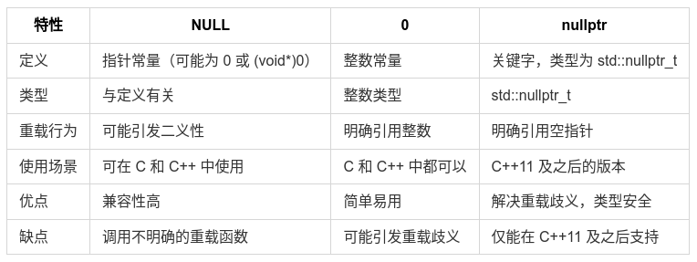
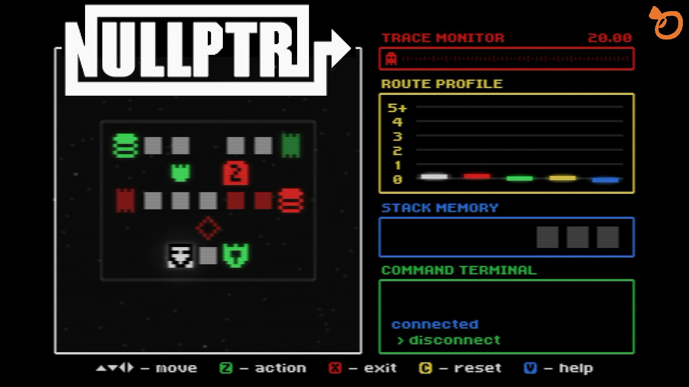

# 浅析 C++ 中的空指针

## 空指针背景与动机


在 C++ 中，我们常听到空指针(null pointer)，但在真实代码中，对于空指针的表示，竟有 `NULL`、`0` 和 `nullptr` 三种之多。就如同茴香的“茴”的几种写法一样。初学者不禁要问：那到底哪一个才是正确优雅的推荐写法呢 ？

**空指针**（null pointer）：表示不指向任何有效的内存地址。在早期 C 语言中，宏 `NULL` 通常被定义为 `0`（或在某些实现中 `(void*)0`），因此整数常量 `0` 也被用作“空指针常量”。随着 C++ 的发展，这种设计在某些场景下会引发二义性（尤其是函数重载时）。
为了解决这一问题，C++11 引入了关键字 `nullptr`，其类型为 `std::nullptr_t`，可以明确表示“空指针”，其目的是为了解决 `NULL`/`0` 在类型和重载解析上的模糊性，从而提高类型安全。


### nullptr vs. NULL vs. 0


1. **NULL 的定义**：
   - 在 C++ 中，**NULL** 通常被定义为 `0` 或者 `((void*)0)`，这导致了在重载函数时可能出现的二义性。
   - 例如，当存在重载函数 `void foo(char*);` 和 `void foo(int);` 时，调用 `foo(NULL);` 将可能导致代码调用 `foo(int)`，这显然不符合直觉。

2. **nullptr 的引入**：
   - **nullptr** 是 C++11 引入的专用关键字，其类型为 **std::nullptr_t**，能够被隐式转换为任何类型的指针或成员指针。
   - 由于类型明确，使用 **nullptr** 不会产生重载解析的问题。
   - 在模板场景中，若需要判断参数是否是空指针字面量，可用 std::is_null_pointer 或 decltype。

**NULL、0 和 nullptr 的区别与联系**


### 示例代码解析
```cpp
#include <iostream>
#include <type_traits>

void foo(char *);
void foo(int);

int main() {
    if (std::is_same<decltype(NULL), decltype(0)>::value)
        std::cout << "NULL == 0" << std::endl;

    if (std::is_same<decltype(NULL), decltype((void*)0)>::value)
        std::cout << "NULL == (void *)0" << std::endl;

    if (std::is_same<decltype(NULL), std::nullptr_t>::value)
        std::cout << "NULL == nullptr" << std::endl;

    foo(0);      // 调用 foo(int)
    // foo(NULL); // 该行不能通过编译
    foo(nullptr); // 调用 foo(char*)
    return 0;
}

void foo(char *) {
    std::cout << "foo(char*) is called" << std::endl;
}

void foo(int i) {
    std::cout << "foo(int) is called" << std::endl;
}
```

运行该代码将产生以下输出：

```bash
foo(int) is called
foo(char*) is called
```

#### 代码分析
1. **类型比较**：
   - `std::is_same` 用来验证 **NULL** 与 **0**、**(void*)0** 和 **nullptr** 的类型。这表明 **NULL** 的定义可能引起混淆。

2. **函数重载**：
   - 使用 `foo(0)` 调用 `foo(int)`。注释掉的 `foo(NULL);` 由于类型不明确而无法编译。
   - 使用 `foo(nullptr)` 明确调用 `foo(char*)`。

总结来说，使用 **nullptr** 能确保代码的可读性和可维护性，避免潜在的错误。因此，建议在 C++11 及之后的版本中，优先使用 **nullptr** 以避免歧义。


### std::nullptr_t 与类型特性

- nullptr 的类型是 std::nullptr_t，可包含在 <cstddef> 或 <type_traits> 中使用。
  类型：decltype(nullptr) == std::nullptr_t。
- 可隐式转换：std::nullptr_t 可以隐式转换为任意对象指针类型和任意指针到成员类型，但不会隐式转换为整型（避免与 0 混淆），从而保证类型安全。
- 布尔上下文：nullptr 在布尔上下文中转换为 false。
- 大小：sizeof(std::nullptr_t) 具体由实现定义的，等于指针大小；不要依赖具体值。
- 地址：不能对 nullptr 取地址（&nullptr 非法）。
- 模板/类型特性：可用 std::is_null_pointer<T> 检查类型是否为 std::nullptr_t。

**示例：类型特性与布尔上下文（使用 type traits 检查类型）**
```cpp
#include <iostream>
#include <type_traits>
int main() {
    std::cout << std::boolalpha;
    std::cout << "decltype(nullptr) is nullptr_t: "
              << std::is_same<decltype(nullptr), std::nullptr_t>::value << "\n";
    if (nullptr)
        std::cout << "nullptr true\n";
    else
        std::cout << "nullptr false\n";

    return 0;
}
```

#### 常见用法与建议
- 返回空指针：
1. 使用 nullptr 明确表示无对象返回（比返回 0 或 NULL 更清晰）。
2. 对于智能指针，返回 nullptr 仍可被正确构造为 std::unique_ptr<T>() 或 std::shared_ptr<T>()。

**示例 - 返回 nullptr**
```cpp
std::unique_ptr<int> make_maybe(bool ok) {
    if (!ok) return nullptr;
    return std::make_unique<int>(42);
}
```

- 指针比较
  使用 ptr == nullptr 或 ptr != nullptr，避免与整型比较。

- 在 C++11 以前的 C 代码或与 C 兼容的接口仍可使用 NULL，但在现代 C++ 代码中请优先使用 nullptr。

#### 注意事项与误用示例
- 不要将 nullptr 强制转换为 void* 再传递给需要其他指针类型的重载（会失去类型信息）。
- 在需要整数 0 的上下文（例如索引）请使用 0，不要混淆语义。
- 在模板或泛型编程中，nullptr 更能表达意图并避免歧义。

**错误示例（不要这样写）**
```cpp
void bar(void*); // 接受 void*
void bar(int);   // 接受 int

bar(NULL);   // 可能被解析为 bar(int)
bar(nullptr);// 不可直接调用 bar(void*)（nullptr 不是 void*），需要显示转换： bar(static_cast<void*>(nullptr))
```

#### 兼容性与迁移建议
- 对于现有代码库，逐步用 nullptr 替换 NULL 与 0 用于表示指针的场景。
- 在与 C 进行互操作时保留 NULL，但在 C++ 专属模块中使用 nullptr。
- 启用编译器警告（如 -Wzero-as-null-pointer-constant）有助于发现潜在问题。

#### 最佳实践（建议）
- 在现代 C++（C++11 及以后）代码中，使用 nullptr 表示空指针。
- 避免用 0 或 NULL 来表示指针，除非出于兼容性考虑。
- 使用智能指针（std::unique_ptr / std::shared_ptr）和 RAII 减少裸指针出现的场景。


## 补充
### nullptr 在 C 与 C++ 中的差异
- C++（自 C++11）有专门的空指针字面量 nullptr（类型为 std::nullptr_t）。它解决了用 0/NULL 表示空指针时的二义性与重载解析问题。
- C 语言没有 nullptr；C 仍使用宏 NULL（通常为 ((void*)0) 或 0）。因此在混合 C/C++ 项目中注意接口边界：在 C 接口中仍需使用 NULL（或 0），在 C++ 代码中优先使用 nullptr。
- StackOverflow 和多篇讨论确认：目前 C 标准并未引入等价于 C++ nullptr 的内建字面量。

### 空指针的大小和空类指针大小分析
- **空指针**的大小在大多数平台上是固定的，通常与系统地址空间的大小相同（例如，在 32 位系统上为 4 字节，在 64 位系统上为 8 字节）。
代码示例如下：
```cpp
#include <iostream>

int main() {
    // 声明空指针
    int* ptr = nullptr;

    // 打印空指针的大小
    std::cout << "空指针的大小: " << sizeof(ptr) << " 字节" << std::endl;

    return 0;
}
```

运行该代码将产生以下输出：

```bash
空指针的大小: 8 字节
```

- **空类指针**的大小通常也是固定的，通常与普通指针大小相同。类指针和普通指针指向的对象类型不同，但其指针本身的大小在大多数情况下是相同的。
代码示例如下：

```cpp
#include <iostream>

class MyClass {
public:
    int data;
};

int main() {
    // 声明一个空类指针
    MyClass* classPtr = nullptr;

    // 打印空类指针和普通指针的大小
    std::cout << "空类指针的大小: " << sizeof(classPtr) << " 字节" << std::endl;
    std::cout << "普通指针的大小: " << sizeof(int*) << " 字节" << std::endl;

    return 0;
}
```

运行该代码将产生以下输出：

```bash
空类指针的大小: 8 字节
普通指针的大小: 8 字节
```

**注意**
> 在64位系统中，两个指针的大小均为8字节；在32位系统中，均为4字节。

### void 指针
**void 指针**（void pointer）：是一种通用指针类型，可以指向任何类型的对象，但无法直接解引用，只能转换为其他类型的指针后使用。
void 指针在 C++ 中提供了灵活性和通用性，尤其适合需要处理多种数据类型的场景。它能够指向任何类型的对象，这使得编写函数和数据结构时，能够更高效地使用内存和处理各种类型的数据。


#### 常见的使用场景
1. **函数参数**：当函数需要处理多种数据类型时，可以接受 void 指针作为参数。例如，C 标准库中的 `qsort` 函数允许用户传入一个 void 指针，以便在排序时可以操作不同类型的数据。
2. **数据结构**：在实现通用数据结构（如链表、栈、队列）时，使用 void 指针来存储不同类型的节点数据。
3. **动态内存分配**：在使用 `malloc` 或 `calloc` 等函数时，返回的是 void 指针，用户可以将其转换为所需类型的指针。

#### 示例代码
**示例 1: 函数参数**
```cpp
#include <iostream>

void displayValue(void* ptr, char type) {
    if (type == 'i') {
        std::cout << "整数值: " << *(static_cast<int*>(ptr))) << std::endl;
    } else if (type == 'f') {
        std::cout << "浮点值: " << *(static_cast<float*>(ptr))) << std::endl;
    } else if (type == 'c') {
        std::cout << "字符值: " << *(static_cast<char*>(ptr))) << std::endl;
    }
}

int main() {
    int intValue = 10;
    float floatValue = 5.5f;
    char charValue = 'A';

    displayValue(&intValue, 'i'); // 输出整数值
    displayValue(&floatValue, 'f'); // 输出浮点值
    displayValue(&charValue, 'c'); // 输出字符值

    return 0;
}
```

**代码输出**
```bash
整数值: 10
浮点值: 5.5
字符值: A
```

**示例 2: 动态内存分配**
```cpp
#include <iostream>
#include <cstdlib> // 包含 malloc 和 free

int main() {
    // 使用 void 指针分配内存
    void* ptr = malloc(sizeof(int)); // 分配一个整数的内存

    if (ptr) {
        // 将 void 指针转换为整型指针并赋值
        *(static_cast<int*>(ptr)) = 20;
        std::cout << "动态分配的整数值: " << *(static_cast<int*>(ptr)) << std::endl;

        // 释放已分配的内存
        free(ptr);
    }

    return 0;
}
```

**代码输出**
```bash
动态分配的整数值: 20
```

### 野指针的区别与联系
**野指针**（dangling pointer）：指向一个无效的内存位置（如已经释放的内存），不可预测其行为，可能导致程序崩溃。
关于野指针更多的内容，请参考 [C++ 中的常见的动态内存问题](../C_Cpp/mem_issue.md)，此处不作过多重复。


## 拓展阅读
- [C++ Core Guidelines](https://isocpp.github.io/CppCoreGuidelines/CppCoreGuidelines) - C++ 编程的最佳实践指南。
- [cppreference — std::nullptr_t](https://en.cppreference.com/w/cpp/types/nullptr_t)
- [Modern C++: nullptr](https://medium.com/@weidagang/modern-c-nullptr-fa494808d31a)
