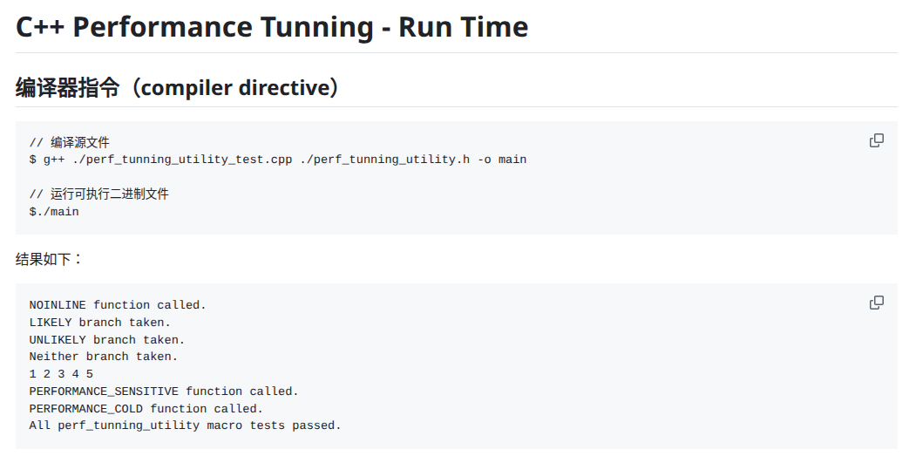

# 性能调优中的常见编译器指令和宏


## 常见编译器指令和宏
在 C++ 性能调优过程中，合理使用编译器指令和宏可以显著提高程序的执行效率。以下介绍常见的编译器指令及其用途，并结合 `perf_tunning_utility.h` 文件给出示例。

### NOINLINE
禁止函数内联，适用于复杂或递归函数，便于调试和性能分析。

```cpp
NOINLINE void slow_path() {
    // 慢路径代码
}
```

### ALWAYS_INLINE
强制函数内联，适用于小型、频繁调用的函数，减少调用开销。

```cpp
ALWAYS_INLINE int fast_add(int a, int b) {
    return a + b;
}
```

### LIKELY / UNLIKELY
分支预测优化，提示编译器某个条件更可能或不太可能为真，提升主路径性能。

```cpp
void foo(int x) {
    if (LIKELY(x > 0)) {
        // 主流程
    } else if (UNLIKELY(x < 0)) {
        // 异常流程
    }
}
```

### PREFETCH
预取内存地址，优化缓存命中率，适用于大数组或频繁访问的数据结构。

```cpp
void process(const int* arr, size_t size) {
    for (size_t i = 0; i < size; ++i) {
        PREFETCH(&arr[i + 1]);
        // 处理 arr[i]
    }
}
```

### PERFORMANCE_SENSITIVE / PERFORMANCE_COLD
标记函数为性能热点或冷点，帮助编译器优化指令布局。

```cpp
PERFORMANCE_SENSITIVE void hot_func() {
    // 高频调用代码
}

PERFORMANCE_COLD void cold_func() {
    // 很少调用的代码
}
```

### RESTRICT
指针限定，提示编译器指针不重叠，优化内存访问。

```cpp
int restrict_sum(int* RESTRICT a, int* RESTRICT b, int n) {
    int sum = 0;
    for (int i = 0; i < n; ++i) {
        sum += a[i] + b[i];
    }
    return sum;
}
```


## 代码演示
由于篇幅限制，这里就没有粘贴具体的代码和使用测试代码，有兴趣的同学可以访问 [compiler_directive](https://github.com/sky-co/cpp_performance_tunning/tree/main/Run_Time)，运行并亲自体验配合其他性能调优根据的效果。
以下是工具代码的测试截图：


---

## 性能调优编译器指令的最佳实践
- **合理使用内联相关指令**：仅对小型、频繁调用的函数使用 `ALWAYS_INLINE`，避免滥用导致代码膨胀。复杂或递归函数建议使用 `NOINLINE`，便于调试和分析。
- **分支预测优化**：在主流程和异常流程分明的场景下使用 `LIKELY` 和 `UNLIKELY`，提升关键路径性能，但不要过度依赖，需结合实际数据分布。
- **内存访问优化**：对大数组或密集数据结构访问场景，使用 `PREFETCH` 提高缓存命中率，减少内存延迟。
- **热点与冷点标记**：将高频调用的性能关键函数用 `PERFORMANCE_SENSITIVE` 标记，低频或异常处理函数用 `PERFORMANCE_COLD` 标记，帮助编译器优化指令布局。
- **指针限定**：在明确无指针重叠的场景下使用 `RESTRICT`，提升编译器内存访问优化能力。
- **统一封装与团队规范**：建议将常用宏统一封装在头文件中，便于团队协作和代码复用，减少重复劳动和出错概率。

---

## 参考资料

- [GCC 官方文档](https://gcc.gnu.org/onlinedocs)
- [Clang Attributes Reference](https://clang.llvm.org/docs/AttributeReference.html)
- [Linux man pages](https://man7.org/linux/man-pages)
- [ISO C++ 标准草案](https://isocpp.org/std/the-standard)
