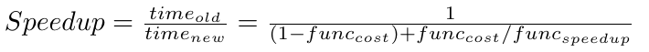
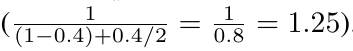
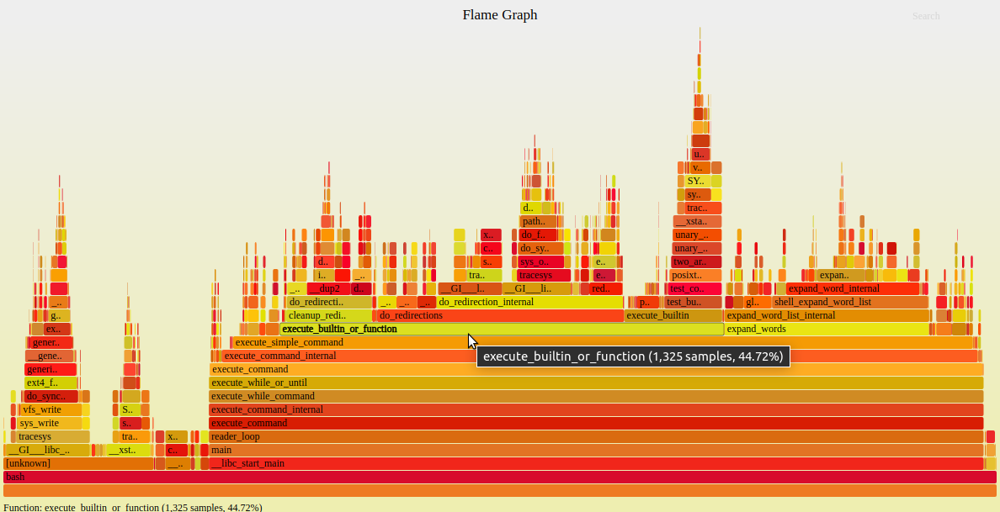

# [译] C/C++ 代码的优化技巧


偶然刷到一篇2014年的短文介绍如何对C/C++进行性能优化，虽然原文是向的领域是图形学中的光线跟踪，但总体来说还是具有一定指导意义。遂将其译成中文，希望对大家写高质量代码有帮助。
文中的每条建议之后，我都基于现代编译器的优化针对该建议添加了备注说明，算是对该建议的更新。

原文链接请参见：[Tips for Optimizing C/C++ Code](https://people.computing.clemson.edu/~dhouse/courses/405/papers/optimize.pdf)

## 1.谨记阿姆达尔定律（Ahmdal’s Law）

- 其中 `func-cost` 表示函数 `func` 运行时间占程序总运行时间的百分比，`func-speedup` 表示该函数加速获得的加速比。
- 因此，若优化一个占程序运行时间`40%`的函数 `TriangleIntersect()`，优化后其运行时间缩短一半，则程序整体性能将提高`25%`，请参见以下计算

- 这公式告诉我们使用频率较低的代码（例如场景加载器）可能无需优化（或仅需少量优化）。
- 一句话总结：“使常用代码更快，不常用代码正确”。

**备注：**
> **阿姆达尔定律**指出，系统整体性能提升受限于无法优化的部分。即使某个环节提升很大，如果它在整体中占比很小，对总性能提升也有限。因此，优化应聚焦于耗时最多的“热点”代码。

---

## 2.先确保代码正确，再进行优化！
- 这绝不意味着你要先花8周写出功能完整的射线追踪器，再花8周去优化！
- 对光线追踪器的优化应分阶段进行。
- 首先编写正确的代码，然后对经常被调用的函数进行优化。
- 最后进行性能分析以找出瓶颈，通过优化或改进算法来消除这些瓶颈。通常改进算法会大幅改变瓶颈所在或许会转移到你意想不到的函数上。而这正是对所有已知高频使用的函数进行显式优化的原因所在。

**备注：**
> 依然适用。过早优化可能浪费时间且引入 bug。现代开发流程强调先保证正确性，再通过性能分析工具定位瓶颈，最后有针对性地优化。

---

## 3.我认识的那些代码高手表示他们花在代码优化的时间至少是编写代码时间的两倍

**备注：**
> 现代开发中，性能调优往往比功能开发更耗时。建议使用性能分析工具（如 perf、gprof、VTune）定位瓶颈，避免盲目优化。同时制定优化目标，以便有目的开展优化工作。

---

## 4.跳转/分支操作很耗时，应尽可能减少使用
- 函数调用除栈内存操作外，还需包括两次跳转。
- 优先选择迭代而非递归。
- 对简短函数使用内联实现，以消除函数的调用开销。
- 将循环移入函数调用内部，例如，将
  ```cpp
  for(i=0; i < 100;i++)
    DoSomething();
  ```
  改为
  ```cpp
  DoSomething() {
      for(i=0; i < 100; i++)
      {
          ...
      }
  }
  ```
- 冗长的 `if...else if...else if...else if...` 条件链会导致链尾分支需要大量跳转（除逐个条件检测外）。
  - 若可行，请改用 `switch` 语句，编译器有时可将其优化为单次跳转的表查找。
  - 若无法使用 `switch` 语句，请将最常见的分支置于条件链开头。

**备注：**
> 现代 CPU 分支预测能力很强，但分支失误仍有性能损失。合理组织分支、减少深层嵌套依然有益，但也无需过度担忧。现代编译器会自动优化部分分支。

---

## 5.注意数组索引的顺序
- 二维及更高维数组在内存中仍按一维方式存储。这意味着（对于C/C++数组）`array[i][j]` 与 `array[i][j+1]` 是相邻存储的，而 `array[i][j]` 与 `array[i+1][j]` 可能相距甚远。
- 按物理内存存储顺序访问数据，可显著提升代码运行速度（有时甚至提升一个数量级以上）！
- 当现代CPU从内存加载数据到缓存时，它们获取的不仅是一个值。而是获取包含请求数据及其相邻数据的内存块（缓存行）。这意味着当 `array[i][j]` 进入CPU缓存后，`array[i][j+1]` 很可能已经在缓存中，而 `array[i+1][j]` 则可能仍在内存中。

**备注：**
> 依然重要。按内存顺序访问数据（提升缓存命中率）对性能影响很大。现代 CPU 的缓存机制使得这一点变得更加关键。但对于 C++ 程序来说，更建议使用标准库容器 `std::vector` 和 `std::array`, 而非 C 风格的数组。

---

## 6.请考虑指令级并行
- 尽管许多应用程序仍依赖单线程执行，但现代CPU已在单核上实现了并行。这意味着单个CPU可能会同时执行4个浮点乘法运算、等待4个内存请求，并为即将发生的分支执行比较操作。
- 为充分利用这种指令并行，代码块（即跳转指令之间）需要包含足够独立的指令，才能让CPU得到充分利用。
- 考虑使用循环展开。
- 考虑使用内联函数。

**备注：**
> 现代编译器能自动进行指令调度和乱序执行，但写出无数据依赖、可并行的代码仍有助于编译器生成高效指令。

---

## 7.避免使用或减少局部变量的数量
- 局部变量通常存储在栈中。但若数量足够少，它们可改为存储在寄存器中。在这种情况下，函数不仅能获得寄存器存储数据的快速访问优势，还能避免创建栈帧的开销。
- （但切勿全部改为全局变量！）

**备注：**
> 现代编译器会自动将活跃变量分配到寄存器。无需刻意减少局部变量，保持代码可读性更重要，但此举也不是鼓励滥用局部变量。

---

## 8.减少函数参数数量
- 原因与减少局部变量相同——它们同样存储在栈中。

**备注：**
> 现代编译器会自动优化参数传递。参数过多可能影响可读性和栈空间，但无需为性能刻意减少参数数量。

---

## 9.结构体应采用引用传递而非值传递
- 在光线追踪器中，我从未见过需要按值传递结构体的情况（即使是向量、点和颜色等简单结构也不例外）。

**备注：**
> 依然适用。大对象建议用引用或指针传递，避免不必要的拷贝。小型 POD 类型（如 int、float、std::pair）值传递无妨。

---

## 10.若函数无需返回值，则无需定义返回类型

**备注：**
> 依然适用。虽然现代编译器会优化未使用的返回值，但还是建议始终明确声明返回类型（如 void），提升代码规范性和可读性，以及可维护性。

---

## 11.尽可能避免强制类型转换
- 整数与浮点数指令常作用于不同寄存器，因此强制转换需进行数据复制。
- 短整型（如char和short）仍需占用一个完整的寄存器，且在存储回内存前需补足至32/64位再转换回较小的类型（此开销需与更大数据类型的额外内存成本进行权衡）。

**备注：**
> 依然适用。频繁类型转换可能导致额外指令和性能损失，且影响代码可读性。

---

## 12.声明C++对象变量时务必谨慎
- 优先使用初始化而非赋值
  ```cpp
  Color c(black);
  ```
  比
  ```cpp
  Color c;
  c = black;
  ```
  更快。

**备注：**
> 优先使用初始化列表，现代编译器可优化初始化过程。推荐使用统一初始化（C++11 起的 `{}`）。

---

## 13.尽可能将类的默认构造函数设计的足够小
- 特别是对于简单且经常使用的类（如color、vector、point等）。
- 这些默认构造函数常在意料之外的情况下被调用。
- 使用构造函数初始化列表。
  使用
  ```cpp
  Color::Color() : r(0), g(0), b(0)
  {}
  ```
  而不是
  ```cpp
  Color::Color() {
      r = g = b = 0;
  }
  ```

**备注：**
> 依然适用。频繁创建对象的类应避免复杂的默认构造逻辑，使用初始化列表更高效。

---

## 14.尽可能使用移位运算 >> 和 << 代替整数乘除法

**备注：**
> 现代编译器会自动将乘以2、除以2等操作优化为移位。无需手动替换，保持表达式语义清晰。

---

## 15.谨慎使用表查找函数。
- 许多人提倡为复杂函数（如三角函数）使用预先计算的值。但在光线追踪中，这通常没有必要。内存查找很耗时（且成本持续攀升），重新计算三角函数往往与从内存中检索值同样快（尤其是考虑到查表会污染CPU的缓存结构时）。
- 但在其他场景中，查找表可能非常有用。对于GPU编程，复杂函数通常更推荐使用查找表。

**备注：**
> 现代 CPU 的缓存和分支预测能力提升，查表未必比直接计算快。仅在性能分析测量结果证明查表更优时才采用。

---

## 16.对于大多数类，请使用运算符 +=、-=、*= 和 /= 代替运算符 +、-、* 和 /
- 简单运算需要创建一个匿名的临时中间对象。
- 例如：
  ```cpp
  Vector v = Vector(1,0,0) + Vector(0,1,0) + Vector(0,0,1);
  ```
  该代码会创建五个无名临时向量：`Vector(1,0,0)`、`Vector(0,1,0)`、`Vector(0,0,1)`、`Vector(1,0,0) + Vector(0,1,0)` 以及 `Vector(1,0,0) + Vector(0,1,0) + Vector(0,0,1)`。
- 稍显冗长的代码：
  ```cpp
  Vector v(1,0,0); v+= Vector(0,1,0); v+= Vector(0,0,1);
  ```
  仅创建两个临时向量：`Vector(0,1,0)` 和 `Vector(0,0,1)`。这节省了6次函数调用（3个构造函数和3个析构函数）。

**备注：**
> 依然适用。复合赋值运算符可减少临时对象创建，提升性能。

---

## 17.对于基本数据类型，请使用运算符 +、-、* 和 / 代替运算符 +=、-=、*= 和 /=

**备注：**
> 现代编译器对基本类型的运算优化已非常充分，两种写法性能无明显差异。代码编写建议以可读性为主。

---

## 18.延迟声明局部变量
- 声明一个对象变量必然会涉及一次函数调用（构造函数）。
- 如果一个变量仅在特定场景下使用（如`if`语句内部），那么请仅在真正需要时才声明，确保构造函数仅在变量被使用时被调用。

**备注：**
> 现代编译器可优化变量作用域，但延迟声明可提升代码可读性和减少无用构造。

---

## 19.对于对象，请使用前缀运算符 ++obj 而非后缀运算符 obj++
- 这在光线追踪器中可能不会构成问题。
- 后缀运算符会创建对象的临时副本（因此会额外调用构造函数和析构函数），而前缀运算符无需临时副本。

**备注：**
> 依然适用。前缀形式可避免不必要的临时对象，尤其是自定义类型。

---

## 20.使用模板时需谨慎
- 不同实例化场景可能需要不同的优化策略！
- 标准模板库已经被优化得很彻底，但若计划实现交互式光线追踪器，还是建议避免使用它。
- 原因何在？只有通过亲手实现，你才会掌握其底层算法，从而明确代码使用的最优方式。
- 更重要的是，根据我的经验，STL库的调试编译版本运行缓慢。通常这不成问题，但当你使用调试版本进行性能分析时就会遇到麻烦。你会发现STL构造函数、迭代器等占用了`15%`以上的运行时间，这使得性能分析输出结果更难解读。

**备注：**
> 现代 STL 已高度优化，除极端性能场景外无需回避。调试版本 STL 性能较低，发布版本影响较小。

---

## 21.计算过程中应避免动态内存分配
- 动态内存非常适合存储场景及其他在计算过程中不变的数据。
- 然而，在大多数系统中，动态内存分配需借助锁机制来控制分配器的访问。对于使用动态内存的多线程应用程序，由于内存分配与释放过程中的等待时间，增加处理器反而可能导致性能下降！
- 即使对于单线程应用程序，在堆上分配内存的开销也高于栈上分配。操作系统需要通过计算来寻找所需大小的内存块。

**备注：**
> 依然适用。频繁分配/释放内存会影响性能，建议复用对象或使用内存池。

---

## 22.查找并利用系统内存缓存的相关信息
- 如果数据结构能容纳于单个缓存行内，那么处理整个类仅需从主内存进行一次数据读取。
- 确保所有数据结构都对齐到缓存行边界（如果数据结构和缓存行都是128字节，但结构中有1字节位于一个缓存行中，其余127字节位于另一个缓存行中，那么性能还是会很差）。

**备注：**
> 依然适用。合理的数据结构布局和对齐可提升缓存命中率，现代编译器可自动优化部分对齐，但手动优化仍有价值。

---

## 23.避免不必要的数据初始化
- 如果需要初始化大块内存，请考虑使用 `memset()` 函数。

**备注：**
> 依然适用。大块连续内存初始化建议用 `memset` 或 `std::fill`，现代编译器可优化部分初始化操作。

---

## 24.尝试采用循环提前终止和函数提前返回机制
- 考虑一条射线与一个三角形的相交问题。常见情况是射线会穿过三角形而不相交，因此应针对此情形进行优化。
- 若选择让射线与三角形平面相交，当射线与平面的交点t值为负时即可立即返回。这使得大约半数的射线-三角形相交计算可跳过重心坐标计算，效率提升显著！一旦确认不存在相交，相交函数应立即终止。
- 同理，某些循环可提前终止。例如投射阴影射线时，只要发现任何遮挡交点，即可立即退出交点检测程序，而无需计算最近交点位置。

**备注：**
> 依然适用。提前终止可减少无效计算，提升性能。

---

## 25.务必在纸上简化方程！
- 在许多方程中，某些项会相互抵消——要么总是如此，要么仅在特定情况下成立。
- 编译器无法发现这些方程简化的机会，但你可以。有时只是消除内部循环中几个耗时的操作，就可以比在其他部分耗费数天时间更能提升程序速度。

**备注：**
> 依然适用。手动简化表达式可减少运算量，编译器难以自动发现所有数学简化。借助 AI 工具可提升此方面的效率。

---

## 26.整数运算、定点运算、32位浮点数运算与64位双精度运算之间的差异，远比你想象的要小
- 在现代CPU中，浮点数运算与整数运算的吞吐量基本相当。在光线追踪这类计算密集型程序中，整数与浮点数运算的成本差异微乎其微。因此，你无需刻意选择整数运算。
- 双精度浮点数运算未必比单精度浮点数运算慢，尤其在64位机器上。我曾见过在同一台机器上，使用全双精度浮点数运算的光线追踪器比使用全单精度浮点数运算的运行更快。但我也见过相反的情况。

**备注：**
> 现代 CPU 浮点数和整数运算性能接近。除非有特殊需求，无需刻意使用整数替代浮点数。

---

## 27.请考虑重构数学表达式以消除耗时操作
- `sqrt()` 函数通常可被规避，尤其在通过比较平方值即可得出相同结果的场景中。
- 如果你需频繁地除以 `x`，那么可以考虑先计算1再乘以结果。此法曾显著提升向量归一化效率（减少3次除法），但近期发现效果 `x` 已趋于平庸。不过当除法次数超过3次时，该方法仍具优势。
- 如果需要执行循环，请确保将计算结果保持不变的运算提到循环外面完成。
- 考虑是否能在循环中增量计算一个变量（而不是每次都从头开始计算该变量）。

**备注：**
> 依然适用。减少高成本运算（如除法、开方）有助于提升性能，尤其在循环和热点代码中。

---

## 补充：现代编译器优化下的最佳实践


1. **保持代码简洁，并信任编译器**
    简单的代码易于维护，且聪明的现代编译器会默默帮你完成很多优化工作。

2. **尽量按（常）引用传参或返回（常）引用**
    例外：简单的数据类型（如 int, bool, float等）使用按值传参或返回值。

3. **inline 关键字的使用**
    inline 小函数。inline 频繁调用的函数。

4. **移除冗余代码**
   删除不再使用的代码，重构并精简冗余代码(请保证有足够的单元测试做回归测试，避免引入新的问题导致代码不稳定)。

5. **使用性能分析工具**
   利用 `perf`、`gprof`、`valgrind`、`clang-tidy` 、 `VTune` 等工具定位真实瓶颈热点代码，避免盲目优化。为避免干扰，仅剖析热点代码。

6. **选择合适的数据结构和算法**
   算法和数据结构的选择对性能影响远大于微观代码优化。

7. **利用现代 C++ 特性**
   使用 `move` 语义、智能指针、范围 for 循环、并发库等提升性能和安全性。

8. **开启编译器优化选项**
   发布版本建议使用 `-O2` 或 `-O3`，并结合 `-march=native`、`-flto` 等高级优化。

9.  **关注多线程和并发**
   现代 CPU 多核化，合理利用多线程和并发库可大幅提升性能。

10. **保持代码可读性和可维护性**
   优化应以可读性为前提，过度手动优化可能导致维护困难。

11. **明确指定标准版本**
   使用 `-std=c++17` 或更高标准，利用新特性提升性能和安全性。

12. **利用编译器警告和静态分析**
   始终开启 `-Wall -Wextra`，并定期用静态分析工具检查代码质量。


## 拓展阅读
- [《Effective Modern C++》](https://u.jd.com/SGU0qyc)
- [《C++ 性能优化手册》](https://u.jd.com/S6UYwaJ)
- [《提高 C++ 性能的编程技术》](https://book.douban.com/subject/6027262/)
- [《C++高性能编程》（The Art of Writing Efficient Programs）](https://u.jd.com/SaUn1Ez)
- [《C++高性能编程》（C++ High Performance 2nd Edition）](https://u.jd.com/S1UWL5K)
- [《CPU性能分析与优化》](https://u.jd.com/SOUx1JV)
